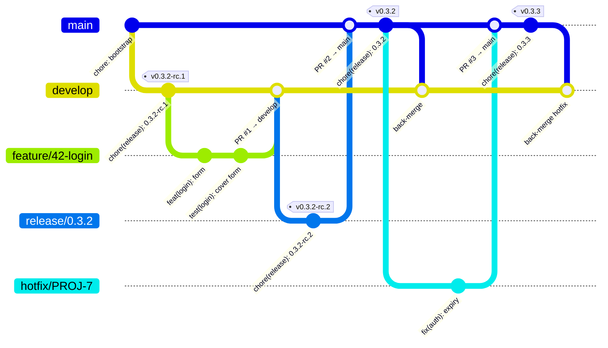

<p align="center">
  
</p>

<p align="center">
  <strong>Your platform team: a web app, a CLI and an MCP server on one core.</strong>
</p>

<p align="center">
  <a href="https://pypi.org/project/action-platform/"></a>
  <a href="https://pypi.org/project/action-platform/"></a>
  <a href="LICENSE"></a>
  <a href="https://github.com/actionplatform/templates"></a>
</p>

---

Every new service costs the same week: scaffold, lint config, CI, versioning, deploy pipeline, IAM. Then the next one drifts from the last. **Action Platform** turns that week into one command — or one click — and keeps every app on the same rails, in your git host and your cloud account.

Three doors, one core:

| | |
|---|---|
| **Web app** | Organizations › projects › apps. Create an app from a template, connect GitHub / GitLab / Bitbucket, cut releases, run deploys — from a browser. One command to self-host. |
| **CLI** | `pipx install action-platform` and the same verbs on your machine: `init`, `branch`, `pr`, `release`, `deploy`, `rollback`, `diagnose`. |
| **MCP server** | The same operations as tools for Claude Code, Codex, Cursor — locally, or against your hosted platform after `action-platform login`. |

## Self-host in one command

```bash
curl -fsSL https://raw.githubusercontent.com/actionplatform/action-platform/master/deploy/install.sh | sudo sh
# with a domain and TLS:
curl -fsSL https://raw.githubusercontent.com/actionplatform/action-platform/master/deploy/install.sh | sudo sh -s -- platform.example.com you@example.com
```

Installs Docker if needed, generates the secrets, starts Postgres + API + web (+ Traefik with Let's Encrypt when a domain is given) and prints the URL. Open it: first account, first organization, connect a code host — done. Files live in `/opt/action-platform`; see [`deploy/`](deploy/) for the compose file and the two Dockerfiles.

## Or just the CLI

```bash
pipx install action-platform

action-platform init web python fastapi --name "orders" --cloud aws/lambda
```

Thirty seconds later you have a FastAPI service with tests, lint, CI wired, a SAM template, a least-privilege IAM policy, and a GitHub repo already pushed (`--no-push` to keep it local).

## Why teams pick it

| | |
|---|---|
| **One command, whole lifecycle** | `init` → `release` → `deploy` → `rollback` → `diagnose` → `destroy`. Same verbs for a Python API on Lambda, a Go service in Docker, a React app on Amplify. |
| **Templates from production, not tutorials** | Every project template is extracted from a real shipping product. Real layout, real CI, real gotchas already fixed. |
| **Cloud is a layer, not a fork** | Projects stay cloud-agnostic. `--cloud aws/lambda` overlays deploy files; swap to `docker` tomorrow with one command. |
| **Your CI, your account, your git** | Runs on GitHub Actions, GitLab CI or Jenkins you already have. Repositories on GitHub, GitLab, Bitbucket or any git server, connected with OAuth. Infra lands in **your** AWS account through OIDC — no long-lived keys, no vendor in the loop. |
| **Governance that ships with the code** | Git-flow and Conventional Commits enforced by git hooks before a commit exists and by CI on every PR; changelog generated; `AGENTS.md` for humans and AI agents; Trivy scans; least-privilege IAM in `requirements/`. |
| **Fix once, everywhere** | CI logic lives in versioned shared repos (`ci-scripts`, `ci-github`, `ci-gitlab`, `ci-jenkins`). Bump `v1`, every project picks it up. |

## What you get

```
action-platform init --list
```

| Type | Stacks | Ready with |
|------|--------|-----------|
| `web` | python (FastAPI, FastMCP), go (Gin), node (React) | `/ping`, versioned API, tests, lint, CI |
| `library` | python, go, php, node, java, rust | packaging, version test, publish workflow |
| `docs` | mkdocs | Material theme, strict build in CI |
| `plugin` | chrome | Manifest V3, popup, background, tests, store zip |
| `empty` | — | `platform.toml` + code quality only |

| Cloud | Adds |
|-------|------|
| `aws/lambda` | SAM template, HTTP API, custom domain, deploy workflow, IAM policy |
| `aws/amplify` | `amplify.yml`, security headers, start-job workflow, IAM policy |
| `docker` | Dockerfile per language, compose |

| Service | Providers |
|---------|-----------|
| `postgres` | docker (local), aws-rds (Terraform/OpenTofu + SSM) |

## Commands

```bash
action-platform init                              # interactive: type → stack → template → name → ci
action-platform init web go gin --ci gitlab       # direct
action-platform init web python --cloud docker    # project + deploy overlay
action-platform init ... --no-push                # skip creating the remote repo
action-platform install [--dry-run]               # existing repo: platform.toml, hooks, code quality, CI — never overwrites

action-platform cloud set aws/lambda              # add or switch the deploy target
action-platform service add postgres --provider aws-rds

action-platform branch feature 42 login           # develop (or main) → pull → feature/42-login → push
action-platform branch hotfix PROJ-7              # from main/master
action-platform gitflow                           # audit current branch + commits; --install-hooks
action-platform pr [--draft] [--dry-run]          # PR for the current branch: target from git-flow, body from commits
action-platform release patch                     # bump, changelog, tag, GitHub release; off main/master → X.Y.Z-rc.N pre-release
action-platform deploy --stage prod
action-platform rollback
action-platform diagnose
action-platform destroy
```

## Git-flow, enforced

Every project follows the same flow. Git hooks refuse the wrong move before it exists; CI refuses it on the pull request; the CLI and the MCP tools guide the right one.



| Branch | Starts from | Merges into | Release |
|--------|-------------|-------------|---------|
| `feature/<code>`, `bugfix/…`, `chore/…`, `docs/…`, `refactor/…`, `test/…`, `ci/…`, `perf/…` | `develop` (or the default branch when there is no `develop`) | `develop` | `X.Y.Z-rc.N` pre-release |
| `release/<version>` | `develop` | `main` and `develop` | `X.Y.Z-rc.N` until merged |
| `hotfix/<code>` | `main` | `main` and `develop` | `X.Y.Z-rc.N` until merged |
| `main` / `master` | — | — | stable `X.Y.Z` → PyPI / npm / … |

Rules the hooks and CI apply: branch names are `<kind>/<code>[-slug]`; commits are [Conventional Commits](https://www.conventionalcommits.org/en/v1.0.0/); no direct commits on `main`, `master` or `develop` except `chore(release):`, `chore(platform):` and the bootstrap commit; a pull request may only target what the table allows.

```bash
action-platform branch feature 42 login     # develop → pull → feature/42-login → push
action-platform gitflow                     # audit branch + commits
action-platform pr                          # target and body from the rules and the commits
action-platform release patch               # rc off main, stable on main
```

Everything a project needs is declared in one file:

```toml
[project]
name = "orders"
type = "web"
stack = "python"
template = "fastapi"
ci = "github"
language = "python"

[source_host]
kind = "github"
repo = "acme/orders"

[deploy]
target = "aws/lambda"

[services]
postgres = "aws-rds"
```

## Use it from an AI client

The platform ships as an MCP server. Claude Code, Codex, Cursor — anything that speaks MCP — gets 17 tools (`list_matrix`, `init_project`, `install_platform`, `start_branch`, `gitflow_audit`, `propose_pull_request`, `release`, `deploy`, `diagnose`, …), 6 prompts that put them in the right order (`new_service`, `ship_feature`, `cut_release`, `deploy_project`, `adopt_repository`, `fix_gitflow`) and 12 skills that make the agent preview and ask before anything leaves the machine.

```bash
pip install "action-platform[mcp]"
action-platform mcp                 # stdio
action-platform mcp --http          # http://127.0.0.1:8765/mcp
```

Claude Code:

```bash
/plugin marketplace add actionplatform/action-platform
/plugin install action-platform@action-platform
```

Any client — add to `.mcp.json`:

```json
{ "mcpServers": { "action-platform": { "command": "uvx", "args": ["--from", "action-platform[mcp]", "action-platform-mcp"] } } }
```

## The web app

[`apps/web`](apps/web) — Next.js on top of the Python API. **Organization › Project › App**: an organization is the tenant and owns its code hosts; a project groups the apps that ship together; an app is one git repository the platform clones, audits, releases and deploys.

- **Setup wizard** on first run: database (SQLite, PostgreSQL or MySQL), first account, first organization, code hosts.
- **Connect with GitHub / GitLab / Bitbucket** through OAuth (or paste a token). Tokens are encrypted at rest and refreshed when they expire.
- **Create project** wizard: type → stack → template → configure → review, with the equivalent `action-platform init` shown. Or add an existing repository by URL.
- Per app: git-flow audit, commits, branches, tags, release preview → confirm → publish, deploy preflight → confirm → ship.
- Strictly monochrome UI; every confirmation is an in-app dialog.

Local development:

```bash
pip install "action-platform[api]"
action-platform api --reload              # http://127.0.0.1:7788, OpenAPI at /docs
cd apps/web && npm install && npm run dev # http://localhost:3000 → /setup
```

Drive a hosted platform from anywhere:

```bash
action-platform login https://platform.example.com   # browser opens, approve the code
action-platform mcp --remote                          # the MCP tools now act on that platform
```

The TypeScript client is generated from the API's OpenAPI schema (`npm run api:types`): the Python response models in `action_platform/api/models.py` are the contract both sides compile against.

## Releases: three artifacts, three versions

One repository, independent versions — declared in `platform.toml`:

```toml
[components.web]
path = "apps/web"

[components.api]
path = "action_platform/api"
```

| Command | Tag | Publishes |
|---|---|---|
| `action-platform release minor` | `v0.3.0` | `action-platform` on PyPI (library + CLI) |
| `action-platform release -c api patch` | `api/v0.1.1` | `actionplatform/action-platform-api` image |
| `action-platform release -c web minor` | `web/v0.2.0` | `actionplatform/action-platform-web` image |

Each component keeps its own `LAST_VERSION` and `CHANGELOG.md` under its path; its changelog lists only the commits that touched it, and the root's excludes them. Off `master` every release is an `-rc.N` pre-release. Images go to Docker Hub and are mirrored to GHCR.

## Layout

```
action_platform/
  core/
    manifest/     platform.toml: read, edit tables
    scaffold/     templates matrix, generate, install into an existing repo
    flow/         git, git-flow rules, branching, pull requests
    release/      versioning, changelog, release, deploy
    config.py · context.py · exception.py · action_platform.py (facade)
  providers/
    source/       github, gitlab, bitbucket, generic — repositories, releases, PRs
  api/            FastAPI for the web app: apps registry, actions, per-request credentials
  remote/         client + device-flow login for a hosted platform
  mcp/            MCP server: local tools, or remote tools after login
  cli/            Typer commands
apps/web/         the web app (see its README)
deploy/           Dockerfiles, docker-compose, install.sh
```

## Extend it

Deploy targets are plugins. Implement the `DeployTarget` contract — `preflight`, `create`, `deploy`, `switch_traffic`, `rollback`, `diagnose`, `delete` — publish it under the `action_platform.deploy_target` entry-point group, and `action-platform deploy` finds it by name.

```python
from action_platform import ActionPlatform, Config
from action_platform.providers.source.github import SourceGithub

tool = ActionPlatform(config=Config(source_host=SourceGithub(repo="acme/orders")))
tool.release("minor")
```

Templates are plain cookiecutters in [actionplatform/templates](https://github.com/actionplatform/templates). Add a stack or a cloud with a pull request — the CLI reads `index.toml`, nothing to redeploy. Point `ACTION_PLATFORM_TEMPLATES` at a local checkout while you work on them.

## Ecosystem

| Repo | Role |
|------|------|
| [templates](https://github.com/actionplatform/templates) | projects, clouds, services |
| [ci-scripts](https://github.com/actionplatform/ci-scripts) | the one implementation of setup / check / release / commit lint |
| [ci-github](https://github.com/actionplatform/ci-github) · [ci-gitlab](https://github.com/actionplatform/ci-gitlab) · [ci-jenkins](https://github.com/actionplatform/ci-jenkins) | thin wrappers per CI |

## License

Apache 2.0.
