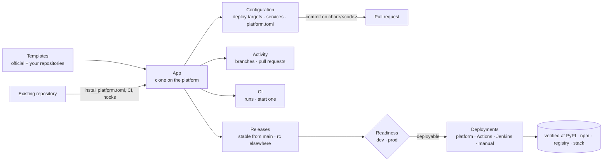

<p align="center">
  
</p>

<p align="center">
  <strong>Your platform team: a web app, a CLI and an MCP server on one core.</strong>
</p>

<p align="center">
  <a href="https://pypi.org/project/action-platform/"></a>
  <a href="https://hub.docker.com/r/actionplatformio/action-platform-web"></a>
  <a href="https://hub.docker.com/r/actionplatformio/action-platform-api"></a>
</p>

---

Every new service costs the same week: scaffold, lint config, CI, versioning, deploy pipeline, IAM. Then the next one drifts from the last. **Action Platform** turns that week into one command — or one click — and keeps every app on the same rails, in your git host and your cloud account.

Three doors, one core:

| | |
|---|---|
| **Web app** | Organizations › teams › projects › apps, with roles (`owner`, `admin`, `deployer`, `developer`, `viewer`). Create an app from a template or import any repository, connect GitHub / GitLab / Bitbucket, edit `platform.toml`, open pull requests, cut releases, see whether each one can reach `dev` and `prod`, deploy it, follow the CI runs and every deployment — wherever it ran — from a dashboard, a release timeline and paged tables. One command to self-host. |
| **CLI** | `pipx install action-platform` and the same verbs on your machine: `init`, `branch`, `pr`, `release`, `readiness`, `deploy`, `rollback`, `diagnose`, `deployments`. |
| **MCP server** | The same operations as tools for Claude Code, Codex, Cursor — locally, or against your hosted platform after `action-platform login`: 38 remote tools that know who you are, which app the current directory is, what your token may do, and can manage projects, teams and members. |

## Self-host in one command

```bash
curl -fsSL https://raw.githubusercontent.com/actionplatform/action-platform/master/deploy/install.sh | sudo sh
# with a domain and TLS:
curl -fsSL https://raw.githubusercontent.com/actionplatform/action-platform/master/deploy/install.sh | sudo sh -s -- platform.example.com you@example.com
```

Installs Docker if needed, generates the secrets, starts Postgres + API + web (+ Traefik with Let's Encrypt when a domain is given) and prints the URL. Open it: first account, first organization, connect a source host — done. Files live in `/opt/action-platform`; see [`deploy/`](deploy/) for the compose file and the two Dockerfiles.

**Already on Dokploy?** Create a *Compose* service and import [`deploy/dokploy/template.b64`](deploy/dokploy/template.b64): secrets and domain are generated, Dokploy's Traefik handles TLS. → [Self-hosting](docs/start_self_hosting.md#dokploy)

## Or just the CLI

```bash
pipx install action-platform

action-platform init web python fastapi --name "orders" --cloud aws/lambda
```

Thirty seconds later you have a FastAPI service with tests, lint, CI wired, a SAM template, a least-privilege IAM policy, and a GitHub repo already pushed (`--no-push` to keep it local).

## Why teams pick it

| | |
|---|---|
| **One command, whole lifecycle** | `init` → `release` → `readiness` → `deploy` → `rollback` → `diagnose` → `destroy`. Same verbs for a Python API on Lambda, a Go service in Docker, a React app on Amplify. |
| **A deploy is always a release — and it knows if it will make it** | Every deployment references a tag. Right after a release is cut, the platform checks whether it can reach each stage — configuration, manifests, credentials, permissions, the destination's state — without building anything, stores the verdict, and refuses a blocked deploy unless you say so. Deployments are recorded whoever ran them (the platform, GitHub Actions, Jenkins, a person) and verified at the destination — PyPI, npm, a registry, a stack. |
| **Templates from production, not tutorials** | Every project template is extracted from a real shipping product. Real layout, real CI, real gotchas already fixed. |
| **Cloud is a layer, not a fork** | Projects stay cloud-agnostic. `--cloud aws/lambda` overlays deploy files; swap to `docker` tomorrow with one command. |
| **Your CI, your account, your git** | Runs on GitHub Actions, GitLab CI, Jenkins or Bitbucket Pipelines you already have — connected to the platform, their runs show next to your releases and a click starts one. Repositories on GitHub, GitLab, Bitbucket or any git server, connected with OAuth; webhooks keep the platform level with them. Infra lands in **your** AWS account through OIDC — no long-lived keys, no vendor in the loop. |
| **Governance that ships with the code** | Git-flow and Conventional Commits enforced by git hooks before a commit exists and by CI on every PR; changelog generated; `AGENTS.md` for humans and AI agents; Trivy scans; least-privilege IAM in `requirements/`. |
| **Fix once, everywhere** | CI logic lives in versioned shared repos (`ci-scripts`, `ci-github`, `ci-gitlab`, `ci-jenkins`, `ci-bitbucket`). Bump `v1`, every project picks it up. |
| **Roles, scoped tokens** | Members join by invitation or are added with an account; `viewer` reads, `developer` branches and commits, `deployer` releases, `admin` and `owner` run the organization. `action-platform login` mints a token with a scope (`read`, `write`, `release`, `admin`) and a reach (one organization or all, a project, an app) that never exceeds your role. **Connected apps** shows every token, which program uses it — Claude Code, Codex, Cursor, the CLI — and every browser session, all revocable. Source-host credentials stay on the platform. |

## What you get

| Type | Stacks |
|------|--------|
| `web` | python (FastAPI, FastMCP), go (Gin), node (Fastify, React), java (Spring), kotlin (Spring), ruby (Sinatra) |
| `library` | python, go, php, node, java, rust |
| `docs` | mkdocs |
| `plugin` | chrome |
| `empty` | `platform.toml` + code quality only |

Cloud overlays `aws/lambda`, `aws/amplify`, `docker`; services `postgres` (docker, aws-rds). Every template comes with tests, lint, CI and `AGENTS.md`. Your organization can add **any git repository** as a template — a plain starter becomes one template, a repository with an `index.toml` a whole catalog. Existing repositories join with one click: the platform installs `platform.toml`, code quality, CI and hooks, and opens the pull request. → [Templates](docs/concept_templates.md)

## Git-flow, enforced

Branches are `<kind>/<code>`, commits are Conventional Commits, `main`/`develop` take no direct commits. Git hooks refuse the wrong move before it exists; CI refuses it on the pull request; the CLI and the MCP tools guide the right one. → [Git-flow](docs/concept_git_flow.md)

## From the browser



## Documentation

[`docs/`](docs/README.md) is organized by what you want to do — **start**, **use**, **concept**, **contribute**:

| | |
|---|---|
| Start | [Getting started](docs/start_getting_started.md) · [Self-hosting](docs/start_self_hosting.md) · [Troubleshooting](docs/start_troubleshooting.md) |
| Use | [Web](docs/use_web.md) · [CLI](docs/use_cli.md) · [MCP](docs/use_mcp.md) · [API](docs/use_api.md) · [Plugins](docs/use_plugins.md) |
| Concept | [Access control](docs/concept_access_control.md) · [Git-flow](docs/concept_git_flow.md) · [Manifest](docs/concept_manifest.md) · [Templates](docs/concept_templates.md) · [Releases](docs/concept_releases.md) · [Deployments](docs/concept_deployments.md) · [Identity](docs/concept_identity.md) · [Observability](docs/concept_observability.md) · [Database](docs/concept_database.md) |
| Contribute | [Architecture](docs/contribute_architecture.md) · [Development](docs/contribute_development.md) · [Writing a plugin](docs/contribute_plugins.md) · [Decisions](https://github.com/actionplatform/strategy/blob/main/adr/README.md) |

Versions and history: [`LAST_VERSION`](LAST_VERSION) / [`CHANGELOG.md`](CHANGELOG.md) for the library and CLI, [`apps/web`](apps/web/CHANGELOG.md) and [`apps/api`](apps/api/app/CHANGELOG.md) for the web app and the API.

## Extend it

Everything is a plugin. Deploy targets (`preflight`, `deploy`, `verify`, `readiness`), CI runners, source hosts, release strategies and changelog formats are named providers behind entry-point groups; git-flow rules, the releaser, the deployer, the readiness checks, the installer and the scaffolder are slots a plugin replaces with a subclass; MCP tools, CLI commands and cloud overlays ride along. `action-platform plugin install aws-lambda` — see [plugins](docs/use_plugins.md).

```python
from action_platform import ActionPlatform, Config
from action_platform.providers.source.github import SourceGithub

tool = ActionPlatform(config=Config(source_host=SourceGithub(repo="acme/orders")))
tool.release("minor")
```

Templates are plain cookiecutters in [actionplatform/templates](https://github.com/actionplatform/templates). Add a stack or a cloud with a pull request — the CLI reads `index.toml`, nothing to redeploy. Point `ACTION_PLATFORM_TEMPLATES` at a local checkout while you work on them, or keep your own repository next to the official one: `action-platform init --source https://github.com/acme/templates.git@main`, or Templates → *Add repository* in the web app.

## Ecosystem

| Repo | Role |
|------|------|
| [templates](https://github.com/actionplatform/templates) | projects, clouds, services |
| [ci-scripts](https://github.com/actionplatform/ci-scripts) | the one implementation of setup / check / release / commit lint |
| [ci-github](https://github.com/actionplatform/ci-github) · [ci-gitlab](https://github.com/actionplatform/ci-gitlab) · [ci-jenkins](https://github.com/actionplatform/ci-jenkins) · [ci-bitbucket](https://github.com/actionplatform/ci-bitbucket) | thin wrappers per CI |

## Contributing

Read [CONTRIBUTING.md](CONTRIBUTING.md) first — git-flow branches, Conventional Commits, one pull request per change, discussion before anything large. Everyone in the project's spaces follows the [Code of Conduct](CODE_OF_CONDUCT.md). Vulnerabilities go through [SECURITY.md](SECURITY.md), never through a public issue.

## License

Apache 2.0.
