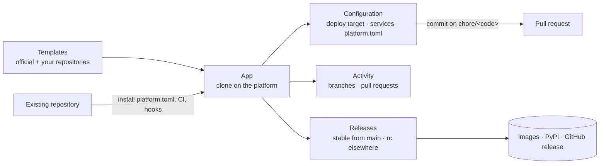

<p align="center">
  
</p>

<p align="center">
  <strong>Your platform team: a web app, a CLI and an MCP server on one core.</strong>
</p>

<p align="center">
  <a href="https://pypi.org/project/action-platform/"></a>
  <a href="https://hub.docker.com/r/actionplatformio/action-platform-web"></a>
  <a href="https://hub.docker.com/r/actionplatformio/action-platform-api"></a>
</p>

---

Every new service costs the same week: scaffold, lint config, CI, versioning, deploy pipeline, IAM. Then the next one drifts from the last. **Action Platform** turns that week into one command — or one click — and keeps every app on the same rails, in your git host and your cloud account.

Three doors, one core:

| | |
|---|---|
| **Web app** | Organizations › teams › projects › apps, with roles (`owner`, `admin`, `deployer`, `developer`, `viewer`). Create an app from a template or import any repository, connect GitHub / GitLab / Bitbucket, edit `platform.toml`, open pull requests, cut releases — from a browser. One command to self-host. |
| **CLI** | `pipx install action-platform` and the same verbs on your machine: `init`, `branch`, `pr`, `release`, `deploy`, `rollback`, `diagnose`. |
| **MCP server** | The same operations as tools for Claude Code, Codex, Cursor — locally, or against your hosted platform after `action-platform login`. |

## Self-host in one command

```bash
curl -fsSL https://raw.githubusercontent.com/actionplatform/action-platform/master/deploy/install.sh | sudo sh
# with a domain and TLS:
curl -fsSL https://raw.githubusercontent.com/actionplatform/action-platform/master/deploy/install.sh | sudo sh -s -- platform.example.com you@example.com
```

Installs Docker if needed, generates the secrets, starts Postgres + API + web (+ Traefik with Let's Encrypt when a domain is given) and prints the URL. Open it: first account, first organization, connect a code host — done. Files live in `/opt/action-platform`; see [`deploy/`](deploy/) for the compose file and the two Dockerfiles.

**Already on Dokploy?** Create a *Compose* service and import [`deploy/dokploy/template.b64`](deploy/dokploy/template.b64): secrets and domain are generated, Dokploy's Traefik handles TLS. → [Self-hosting](docs/self-hosting.md#dokploy)

## Or just the CLI

```bash
pipx install action-platform

action-platform init web python fastapi --name "orders" --cloud aws/lambda
```

Thirty seconds later you have a FastAPI service with tests, lint, CI wired, a SAM template, a least-privilege IAM policy, and a GitHub repo already pushed (`--no-push` to keep it local).

## Why teams pick it

| | |
|---|---|
| **One command, whole lifecycle** | `init` → `release` → `deploy` → `rollback` → `diagnose` → `destroy`. Same verbs for a Python API on Lambda, a Go service in Docker, a React app on Amplify. |
| **Templates from production, not tutorials** | Every project template is extracted from a real shipping product. Real layout, real CI, real gotchas already fixed. |
| **Cloud is a layer, not a fork** | Projects stay cloud-agnostic. `--cloud aws/lambda` overlays deploy files; swap to `docker` tomorrow with one command. |
| **Your CI, your account, your git** | Runs on GitHub Actions, GitLab CI or Jenkins you already have. Repositories on GitHub, GitLab, Bitbucket or any git server, connected with OAuth. Infra lands in **your** AWS account through OIDC — no long-lived keys, no vendor in the loop. |
| **Governance that ships with the code** | Git-flow and Conventional Commits enforced by git hooks before a commit exists and by CI on every PR; changelog generated; `AGENTS.md` for humans and AI agents; Trivy scans; least-privilege IAM in `requirements/`. |
| **Fix once, everywhere** | CI logic lives in versioned shared repos (`ci-scripts`, `ci-github`, `ci-gitlab`, `ci-jenkins`). Bump `v1`, every project picks it up. |
| **Roles, not shared tokens** | Members join by invitation or are added with an account; `viewer` reads, `developer` branches and commits, `deployer` releases, `admin` and `owner` run the organization. Code-host credentials stay on the platform — the CLI and MCP act with your role through the hosted API. |

## What you get

| Type | Stacks |
|------|--------|
| `web` | python (FastAPI, FastMCP), go (Gin), node (React) |
| `library` | python, go, php, node, java, rust |
| `docs` | mkdocs |
| `plugin` | chrome |
| `empty` | `platform.toml` + code quality only |

Cloud overlays `aws/lambda`, `aws/amplify`, `docker`; services `postgres` (docker, aws-rds). Every template comes with tests, lint, CI and `AGENTS.md`. Your organization can add **any git repository** as a template — a plain starter becomes one template, a repository with an `index.toml` a whole catalog. Existing repositories join with one click: the platform installs `platform.toml`, code quality, CI and hooks, and opens the pull request. → [Templates](docs/templates.md)

## Git-flow, enforced

Branches are `<kind>/<code>`, commits are Conventional Commits, `main`/`develop` take no direct commits. Git hooks refuse the wrong move before it exists; CI refuses it on the pull request; the CLI and the MCP tools guide the right one. → [Git-flow](docs/git-flow.md)

## From the browser



## Documentation

| | |
|---|---|
| [Self-hosting](docs/self-hosting.md) | `install.sh`, compose, Dokploy, environment, upgrades, backups |
| [Web app](docs/web-app.md) | organizations › teams › projects › apps, roles, setup wizard, code hosts, template repositories, importing, configuration, releasing from the browser |
| [CLI](docs/cli.md) | every command |
| [Git-flow](docs/git-flow.md) | branch kinds, commit format, what hooks and CI refuse |
| [`platform.toml`](docs/platform-toml.md) | the file that declares a project |
| [Templates](docs/templates.md) | the matrix, adding your own repositories, how to add to the official one |
| [MCP](docs/mcp.md) | tools and prompts for AI clients, locally or against a hosted platform |
| [Releases](docs/releases.md) | versions per component, tags, what each publishes |
| [Architecture](docs/architecture.md) | packages, the API, providers, how credentials travel |
| [Development](docs/development.md) | running it locally, tests, regenerating the API client |

## Extend it

Deploy targets are plugins. Implement the `DeployTarget` contract — `preflight`, `create`, `deploy`, `switch_traffic`, `rollback`, `diagnose`, `delete` — publish it under the `action_platform.deploy_target` entry-point group, and `action-platform deploy` finds it by name.

```python
from action_platform import ActionPlatform, Config
from action_platform.providers.source.github import SourceGithub

tool = ActionPlatform(config=Config(source_host=SourceGithub(repo="acme/orders")))
tool.release("minor")
```

Templates are plain cookiecutters in [actionplatform/templates](https://github.com/actionplatform/templates). Add a stack or a cloud with a pull request — the CLI reads `index.toml`, nothing to redeploy. Point `ACTION_PLATFORM_TEMPLATES` at a local checkout while you work on them, or keep your own repository next to the official one: `action-platform init --source https://github.com/acme/templates.git@main`, or Templates → *Add repository* in the web app.

## Ecosystem

| Repo | Role |
|------|------|
| [templates](https://github.com/actionplatform/templates) | projects, clouds, services |
| [ci-scripts](https://github.com/actionplatform/ci-scripts) | the one implementation of setup / check / release / commit lint |
| [ci-github](https://github.com/actionplatform/ci-github) · [ci-gitlab](https://github.com/actionplatform/ci-gitlab) · [ci-jenkins](https://github.com/actionplatform/ci-jenkins) | thin wrappers per CI |

## Contributing

Read [CONTRIBUTING.md](CONTRIBUTING.md) first — git-flow branches, Conventional Commits, one pull request per change, discussion before anything large. Everyone in the project's spaces follows the [Code of Conduct](CODE_OF_CONDUCT.md). Vulnerabilities go through [SECURITY.md](SECURITY.md), never through a public issue.

## License

Apache 2.0.
