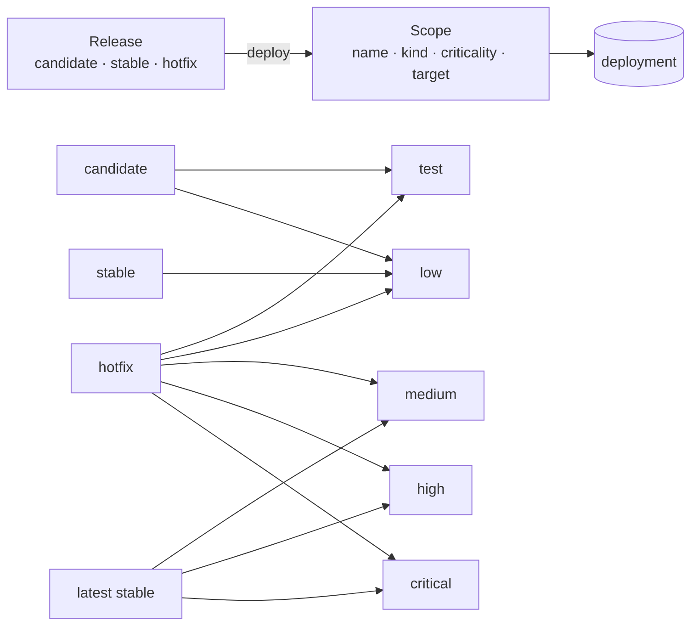

# 0009 — A deploy lands on a scope; the scope's criticality decides which releases it takes

**Status**: proposed · 2026-09-18 · [#275](https://github.com/actionplatform/action-platform/issues/275)

## Context

Deploys name a stage, `dev` or `prod`. Two values cannot say how much a destination matters, and the rule "a deploy ships a release" has no second half: nothing says which release may reach which place. Apps of different kinds — a web API, a scheduled job, a queue worker — are verified as if they were all web.

## Decision

A **scope** is the unit a release is deployed to: a name, a kind (`web`, `job`, `worker`, `static`, `library`), a criticality, a target and who runs deploys to it.

| Value | Name | Definition |
|---|---|---|
| `test` | Test | No production use. |
| `low` | Low | Little impact; downtime is tolerable. |
| `medium` | Medium | Affects processes, but a manual alternative exists. |
| `high` | High | Affects important operations and many users. |
| `critical` | Critical | Essential to the business: stops operations, causes financial loss or legal risk. |

The levels are ordered `test < low < medium < high < critical`.

Scopes belong to the app; the organization keeps presets and the policy. A release is cut without any scope in mind; a deployment always names one.

Criticality selects the rule. By default a candidate release is tried on `test` and `low` only; a stable release goes to `low` and above, never to `test`; from `medium` up only the latest stable release is deployed; a hotfix — a release cut from a `hotfix/*` branch — goes to any scope. The policy is a table the organization may change per criticality; the order of levels is fixed.

The rules run as readiness checks (`scope.release-shape`, `scope.latest`) and the existing deploy gate enforces them. Plugins keep seeing `ctx.stage = scope.name`, so stacks keep their names and no plugin changes for the first step.

## Consequences

`stage` becomes a scope name; `dev` and `prod` migrate to a `test` and a `high` scope. Deployment and readiness rows point at scopes. Kinds change how a target verifies and diagnoses, not how it deploys. One more thing to create before the first deploy of an app — the presets make it one click. The strategy, the model and the rollout are in [scopes](../concept_scopes.md).
