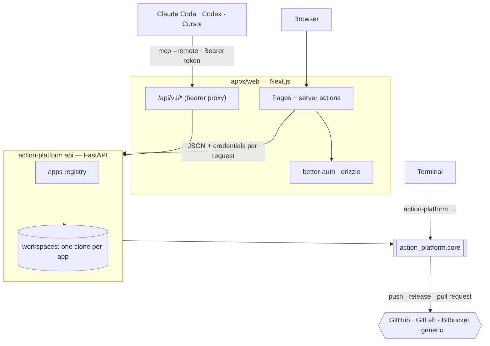
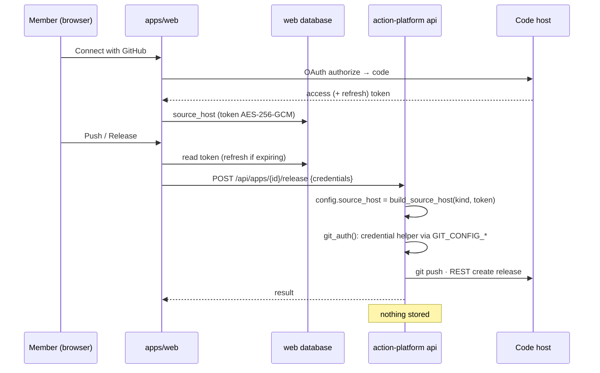
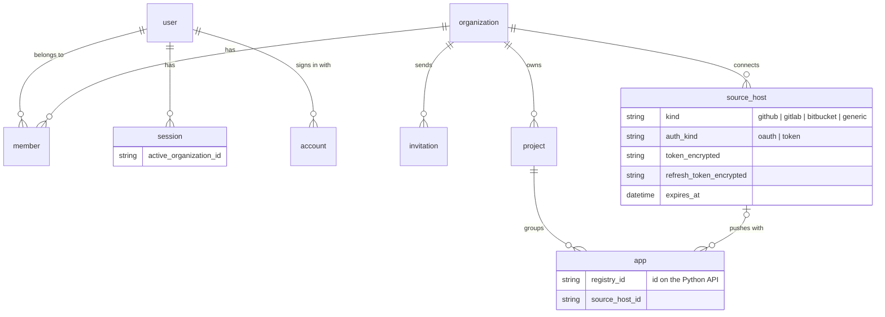

# Architecture



## Packages

```
action_platform/
  core/
    manifest/     Manifest: platform.toml as an object (project, source_host, services; set_source_host, set_deploy_target, set_service)
    scaffold/     store (TemplateSource, TemplateStore: checkouts), templates (Matrix, Leaf, Cloud, Service), detect (LanguageDetector), install (Installer: plan/apply), generate (cookiecutter, overlays, push)
    flow/         repository (Repository: every git command on one clone, follow_remote, stashed), workflow (GitFlow: audit, start, propose, open_pr, install_hooks), gitflow (the rules as pure functions), git (ref/url policy, per-request credentials)
    release/      versioning (Version, VersionFiles), changelog, components, release (Releaser: plan → apply), deploy (Deployer)
    config.py     Config.from_toml → source host, deploy targets, components
    context.py    Context, DeployResult, Diagnosis, PRRef, ReleaseRef
    action_platform.py   ActionPlatform: the facade the CLI, MCP and API call (releaser, deployer, flow)
  providers/
    source/       rest (urllib helper), github, gitlab, bitbucket, generic; build_source_host(kind, …)
  abc/            SourceHost, CIRunner, DeployTarget, Vcs, TemplateStoreABC contracts
  api/            FastAPI: registry (apps.json + workspaces), models (the OpenAPI contract), server, credentials
  remote/         client (urllib) + device-flow login + credentials file
  mcp/            server (local or --remote), tools/*, prompts
  cli/            Typer commands
  observability.py   Sentry init shared by the CLI and the API (docs/observability.md)
  hooks/          commit-msg, pre-commit, pre-push, gitflow.sh
apps/web/         the web app
deploy/           Dockerfiles, compose, install.sh
```

### Objects in the core

Every operation starts from a `Repository` — one clone, every git command as a method, credentials and identity taken from the request context — and layers on top of it:

| Object | Does | Where used |
|---|---|---|
| `Manifest.of(root)` | reads and edits `platform.toml` table by table | install, generate, API configuration |
| `GitFlow(repo)` | `audit()`, `start(kind, code)`, `propose()`, `open_pr()`, `install_hooks()` | CLI `branch`/`pr`/`gitflow`, MCP, API flow |
| `Releaser(config, repo)` | `plan(level)` → `ReleasePlan` (dry run), `apply(plan)`; a refused push undoes commit and tag | CLI/MCP/API release |
| `Deployer(config, repo)` | deploy, rollback, diagnose, destroy through the `[deploy]` targets | CLI/MCP/API deploy |
| `Installer(root, …)` | `plan()` / `apply()`: platform.toml, LAST_VERSION, AGENTS.md, quality config, CI files, hooks | CLI `install`, API import |
| `TemplateStore()` | `official()` and `checkout(source)` clones of template repositories | matrix loading |
| `Version` / `VersionFiles` | semver value object; the files a project declares its version in | releaser |

Rules that need no repository — branch names, commit messages, merge targets — stay pure functions in `flow/gitflow.py`, shared with `ci-scripts/gitflow.sh`. `ActionPlatform` is the facade the CLI, MCP and API call; it exposes `releaser`, `deployer` and `flow` for one project.

Deploy targets and CI runners are plugins discovered through the `action_platform.deploy_target` / `action_platform.ci_runner` entry-point groups (`core/module.py`).

## The API

`action-platform api` — one process, file-backed, single-tenant. Multi-tenancy (organizations, projects, who may touch which app) is the web app's job; the API trusts its caller.

| Endpoint | |
|---|---|
| `GET /api/matrix`, `GET /api/gitflow/rules`, `GET /api/version` | static |
| `GET/POST /api/apps`, `POST /api/apps/init`, `DELETE /api/apps/{id}` | registry: add by git url (clone), generate from a template, remove (deletes the clone) |
| `POST /api/apps/{id}/sync`, `/push` | fetch + fast-forward; create the remote and push |
| `GET /api/apps/{id}`, `/gitflow`, `/commits`, `/branches`, `/tags` | state of the clone |
| `POST /api/apps/{id}/release`, `/deploy`, `GET /diagnose` | actions; `dry_run` defaults to true |

Every response is a Pydantic model in `api/models.py`; `apps/web` generates its TypeScript client from the resulting OpenAPI schema (`npm run api:types`).

## How credentials travel



1. A member connects a code host in the web app (OAuth) or pastes a token. The token is AES-256-GCM encrypted (`lib/crypto.ts`, key derived from `BETTER_AUTH_SECRET`) and stored in `source_host`.
2. An app remembers which host it uses (`app.source_host_id`).
3. A push / release server action decrypts the token — refreshing it first for GitLab / Bitbucket — and sends it in the request body as `credentials {kind, token, username, base_url, owner}`.
4. The API rebuilds `config.source_host` with that token (`api/core/credentials.py: apply`) and wraps the git calls in `git_auth()`. The credentials go into a `contextvars.ContextVar` that `core/flow/git.git_env()` reads when it spawns git, so they belong to that request only — concurrent requests on other threads never see them and the process environment is never touched. Git receives them as a credential helper through `GIT_CONFIG_COUNT/KEY/VALUE`, so the token never lands in `.git/config` or on a command line, and the host's own helpers (keychain, `gh`) are cleared for that call.
5. Nothing is stored on the API side.

## The web app's data



`user`, `session`, `account`, `verification`, `device_code` come from better-auth (and its `organization` / `deviceAuthorization` plugins); `project`, `app`, `source_host` are the platform's. Same schema in three dialects under `apps/web/lib/db/schema/`, migrations per dialect under `apps/web/drizzle/`, applied on boot.

## Trust between web and API

The browser never talks to the Python API. The web app authenticates users (sessions, roles) and calls the API server-side over the private network; the CLI and MCP go through the web app's `/api/v1` proxy with a bearer token from `action-platform login`: a JWT carrying user, organization and scope (`read`, `write`, `release`, `admin`), checked against the `api_token` row it names (revocation, expiry) and then against the caller's role — a request must pass both. Between web and API a shared secret, `AP_API_TOKEN`, is sent as `Authorization: Bearer` and checked in constant time on every route but `/api/version`, so only the web app can drive clones, git and the workspaces.
