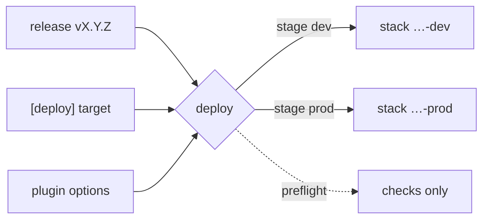

# Deployments

A deploy takes a release and puts it in a cloud, one environment at a time. This guide is the model behind the Deployments tab, `action-platform deploy` and `POST /api/v1/apps/{id}/deploy` — what a stage is, what a target is, how a deploy becomes a job, what the history shows and how an app leaves the cloud again. For how the cloud trusts the platform without keys, read [identity](concept_identity.md).



## Stages

An app has two environments, `dev` and `prod`. Each one is a separate deployment of the same repository — on `aws/lambda`, a separate CloudFormation stack named `ap-<org>-<project>-<app>-<stage>` — with its own history, its own URL and its own last deployed version. A stage receives whatever release you pick: `dev` may run `1.4.0` while `prod` is still on `1.3.2`, and nothing forces an order between them.

One deploy at a time per stage. While a deploy or a preflight to a stage is queued or running, the API refuses another for the same stage with `409` (`a deploy to prod is already running; wait for it to finish`), the web disables the button and says why, and the CLI prints the same message. The other stage is free. The rule exists because the stack and the platform's clone are touched by one job at a time; two `sam deploy` on the same stack would corrupt its state.

## What is deployed

A deploy ships a release, never a working tree. The worker checks the tag `vX.Y.Z` out, builds and deploys that commit, and puts the branch back afterwards. Without a release there is nothing to deploy: the web lists the releases of the app, the CLI takes `--version` or the tag HEAD sits on, the API takes `version` in the body — anything else is refused. What runs in the cloud is therefore always reproducible from the tag alone. Cutting a release is in [releases](concept_releases.md).

## Targets

The target is where the app goes. `platform.toml` declares it under `[deploy]`:

```toml
[deploy]
target = "aws/lambda"
region = "us-east-1"
```

A target is a plugin — `aws/lambda` comes from [apx-aws-lambda](https://github.com/actionplatform/apx-aws-lambda), bundled in the API image — and it brings three things: a **cloud overlay** for the templates (the SAM template, a deploy workflow, a `/health` route, an adapter per language) applied by *Configuration → Deploy target* or `action-platform cloud set`; the **deploy steps** (`preflight`, `create`, `deploy`, `switch_traffic`, `delete`); and, when it needs settings, the **options** an organization fills in under Plugins → Configure. The platform passes every option to the deploy as `AP_<PLUGIN>_<KEY>` — for `aws/lambda`, `AP_AWS_LAMBDA_PROXY_URL` — with `AP_APP=<org>/<project>/<app>`, so the repository only needs `target`; a value under `[deploy]` in the repository still wins. The plugin contract is in [writing a plugin](contribute_plugins.md), the overlays in [templates](concept_templates.md).

## Preflight

**Run preflight** (`dry_run: true`, the default of the API body; `--dry-run` on the CLI) runs the target's checks and stops: the credentials can be obtained, the template renders, the toolchain is there. Nothing in the cloud changes. It runs as a job like a deploy, occupies the stage the same way, and shows in the history as *Preflight*. Run it after connecting a new target or a new account; a deploy runs the same checks first anyway.

## A deploy as a job

On the platform a deploy never runs on the request: the API answers `202` with a job id and the worker does the work.

| Step | Where | What |
|---|---|---|
| 1 | API | role ∩ scope ∩ reach (`app.release`), no live deploy for the stage, record whether the caller manages the organization |
| 2 | API | job `deploy` queued; the row is in the history at once |
| 3 | worker | claims the job, opens the clone, checks the tag out |
| 4 | worker | mints the app's identity token (`org:…:project:…:app:…`, stage, `org.manage` when step 1 said so) |
| 5 | target | preflight, then build and deploy with credentials obtained from the token — on AWS through the deploy proxy |
| 6 | worker | result (URL, stack) or error on the job; the history row updates |

A job is one row in `job`: kind, status (`queued` → `running` → `done` or `failed`), payload, attempts, result or error. A worker that dies mid-deploy leaves the job `running` until the reaper (30 minutes) puts it back in the queue with `worker lost`; a job that crashes is retried up to three times with a growing delay (30 s, 60 s, 120 s); a job the platform refused — a missing tag, a target that said no — fails at once. The status the web shows is the row's. The tables are in [database](concept_database.md), the code path in [architecture](contribute_architecture.md#a-deploy-end-to-end).

The first deploy of an app on `aws/lambda` also **registers** it on the deploy proxy: the proxy creates the app's two roles and its grant, which needs the token to carry `org.manage` — so that first deploy must come from someone who manages the organization (owner or admin). Anyone else gets `the proxy does not know <app> yet, and this deploy may not register it` and asks a manager to deploy once, or to run `action-platform aws-lambda proxy create`. Later deploys by any deployer go through.

## History

**Deployment history** is the list of `deploy` and `destroy` jobs of the app, newest first: status, stage, type (Deploy, Preflight, Tear down), version, duration, who, when. A row expands into the summary, the full log, the run id, timestamps and **Redeploy**, which queues the same release to the same stage again. A failed row keeps the error and the log; nothing is deleted from the history when a stack goes away. `GET /api/v1/jobs?app=<id>&kind=deploy` is the same list.

## Redeploy and rollback

Deploying an older release to a stage is the rollback: pick it in the Deploy card, or **Redeploy** on its row in the history. There is no separate state to restore; the tag is the state. `action-platform rollback --stage prod` from the CLI is the target's own undo — on `aws/lambda` a CloudFormation `rollback-stack` to the previous stack state, which cannot name a version; `--to X.Y.Z` is refused there and a deploy of that release does the job.

## Leaving the cloud

Deleting an app offers **Also tear down `<target>`** (`?cloud=true`): the API queues a `destroy` job, the worker runs the target's `delete` for every stage — `sam delete` of each stack — and, on the proxy, removes the app's roles and grant when no stage is left; only then the app leaves the platform. A failure leaves the app in place with the error on the history (*Tear down*). Deleting a project with **Delete stacks on the cloud** does the same for every app in one `destroy_project` job; the card says *Tearing down* meanwhile. `action-platform destroy` is the CLI's version for one target of the repository you are in.

Deleting without the option removes the app from the platform only; the stacks keep running, and the repository's own CI, when the overlay installed one, can still deploy on its own. Deleting the repository on the host is a separate checkbox of the same dialog — [web](use_web.md#deleting).

## Related

[Identity](concept_identity.md) — how the deploy gets credentials · [releases](concept_releases.md) — what a deploy ships · [templates](concept_templates.md) — the cloud overlays · [plugins](use_plugins.md) — configuring a target · [troubleshooting](start_troubleshooting.md) — when a deploy fails.
