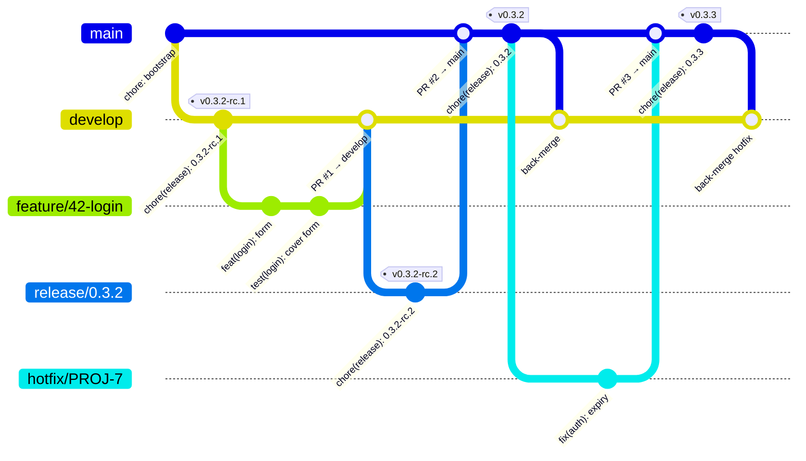

# Git-flow, enforced

Every project follows the same flow. Git hooks refuse the wrong move before it exists; CI refuses it on the pull request; the CLI and the MCP tools guide the right one.



| Branch | Starts from | Merges into | Release |
|--------|-------------|-------------|---------|
| `feature/<code>`, `bugfix/…`, `chore/…`, `docs/…`, `refactor/…`, `test/…`, `ci/…`, `perf/…` | `develop` (or the default branch when there is no `develop`) | `develop` | `X.Y.Z-rc.N` pre-release |
| `release/<version>` | `develop` | `main` and `develop` | `X.Y.Z-rc.N` until merged |
| `hotfix/<code>` | `main` | `main` and `develop` | `X.Y.Z-rc.N` until merged |
| `main` / `master` | — | — | stable `X.Y.Z` → PyPI / npm / … |

Rules the hooks and CI apply: branch names are `<kind>/<code>[-slug]`; commits are [Conventional Commits](https://www.conventionalcommits.org/en/v1.0.0/); no direct commits on `main`, `master` or `develop` except `chore(release):`, `chore(platform):` and the bootstrap commit; a pull request may only target what the table allows.

What the audit (`action-platform gitflow`, the app's *Branch policy* card) looks at: on a work branch, the commits since it left `develop`/`main`; on `main`, `master` or `develop`, the commits after the last tag — and once `platform.toml` is in the history, only those on the path down from the commit that added it. A repository imported with years of commits in another style is not asked to rewrite them, and merged pull requests are not "direct commits". The hooks, not the audit, are what stop a commit landing on a protected branch.

```bash
action-platform branch feature 42 login     # develop → pull → feature/42-login → push
action-platform gitflow                     # audit branch + commits
action-platform pr                          # target and body from the rules and the commits
action-platform release patch               # rc off main, stable on main
```

## Kinds

`feature bugfix hotfix release support chore docs refactor test ci perf` — branch names are `<kind>/<code>[-slug]`; `<code>` is the issue or ticket (`42`, `PROJ-7`, `0.3.2` for a release).

## Where the rules live

One implementation, three enforcers:

| Where | What |
|---|---|
| `action_platform/hooks/` → `.git/hooks` (`action-platform install`) | `commit-msg` refuses a non-conventional subject or a direct commit on a protected branch; `pre-push` refuses pushing a protected branch with non-release commits |
| [ci-scripts](https://github.com/actionplatform/ci-scripts) `gitflow.sh` | the same checks on every pull request, from GitHub Actions, GitLab CI or Jenkins |
| `action_platform/core/flow/gitflow.py` | the rules as Python for the CLI, the MCP tools and the web app's audit |

Hooks you already had are kept: an existing `pre-commit`, `commit-msg` or `pre-push` that is not ours is renamed to `<name>.pre-action-platform` and still runs after the platform's check. When `core.hooksPath` points at an unversioned directory the hooks go there instead of `.git/hooks`; when it points at a versioned one (Husky's `.husky/`, lefthook) nothing is touched and git-flow is enforced by CI only — the CLI says so.

Commits allowed on protected branches: `chore(release): …`, `chore(platform): …`, `chore: bootstrap …`, merges and reverts.
