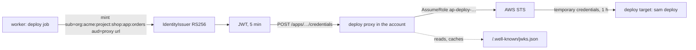
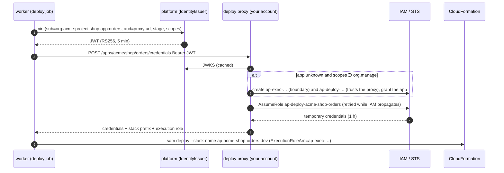

# Identity for deploys — the platform as an OIDC issuer

A deploy needs to be someone to the cloud it talks to. The platform does not keep cloud access keys; it signs a short-lived token that says which organization, project and app the deploy runs for, and the cloud trusts that token the way it trusts GitHub Actions — through OpenID Connect.

## What the platform publishes

- `GET /.well-known/openid-configuration` — issuer (`AP_PUBLIC_URL`), `jwks_uri`, RS256.
- `GET /.well-known/jwks.json` — the public key. The pair is made on first use and kept in `signing_key` with the private half sealed by `AP_AUTH_SECRET`.

Both are open, served through the web app's domain, and what a cloud reads when you register the platform as an identity provider.

## Tokens

| Who asks | Subject | Extra claims |
|---|---|---|
| the worker, for a deploy job | `org:<org>:project:<project>:app:<app>` | `organization`, `project`, `app`, `stage` |
| `POST /api/v1/identity/token` — a caller with `app.release` (the CLI on a logged-in machine) | `org:<org>` (`:project:…:app:…` when the body names them) | `organization`, `project`, `app`, `actor` (the user's email), `scopes` (the caller's permissions in the organization — what a service such as the aws-lambda deploy proxy checks before an admin call) |

`aud` is what the caller asks for (`sts.amazonaws.com`), `exp` five minutes out, `jti` unique. A deploy target reaches the token through `ctx.identity_token(audience)` — None on a machine that is neither the platform nor logged in to one, and the target says so.

## Trusting it on AWS — the deploy proxy

The platform's way on AWS is the **deploy proxy** of [apx-aws-lambda](https://github.com/actionplatform/apx-aws-lambda): one small Lambda (Function URL, DynamoDB) installed once per account with `proxy/deploy.sh <platform url> <organization>`. It is the only thing in the account that trusts the platform's keys, and it decides per app.

What the proxy enforces:

- **Grants** — an app deploys only when the token's `sub` matches a subject prefix granted to it (`org:acme:project:shop:app:orders` by default; `org:acme` would mean anyone in the organization). `PUT /apps/{app}/grants` changes the list.
- **Two roles per app**, under `/action-platform/`: `ap-deploy-<org>-<project>-<app>` (what `sam deploy` runs as — CloudFormation, Lambda, API Gateway, logs and the SAM bucket, on stacks named `ap-<org>-<project>-<app>*` only) and `ap-exec-<org>-<project>-<app>` (what the function runs as, capped by the `ActionPlatformBoundary` managed policy scoped by the role's `action-platform:prefix` tag).
- **Stack names** follow the prefix: the target passes `--stack-name ap-<org>-<project>-<app>-<dev|prod>` itself; `samconfig.toml`'s `stack_name` only matters without a proxy.
- **Registration happens on the first deploy** by someone who manages the organization: the job payload records `manages` and the token then carries `scopes: ["org.manage"]`, which the proxy requires to create an app (`POST /apps/{app}`) or delete it (`DELETE`). Anyone else is told to ask a manager.
- **Deletion** mirrors it: the target's delete drops the stage's stack and, when no stage is left, the app on the proxy — roles and grant.

The proxy's URL is the one setting the plugin asks for (Plugins → AWS Lambda → Configure → *Deploy proxy URL*), stored per organization in `plugin_option` and handed to every deploy job as `AP_AWS_LAMBDA_PROXY_URL` with `AP_APP=<org>/<project>/<app>`; a repository may still pin `proxy_url` and `app` under `[deploy]`.

Without the proxy, `[deploy] role_arn = "…"` still works: the platform registered once per account as an identity provider, one role per app with a trust policy on `aud` and `sub`, `sts:AssumeRoleWithWebIdentity` with the same token. The same mechanism serves GCP (workload identity federation) and Azure (federated credentials): a plugin for those reads the same token.

## Why not keys

A stored key is one secret for every app and every stage, valid until someone rotates it, invisible in CloudTrail beyond the user it belongs to. A token per deploy is scoped to one app, expires in minutes, and the cloud logs the `sub` — the audit trail names the app, not a shared account.
