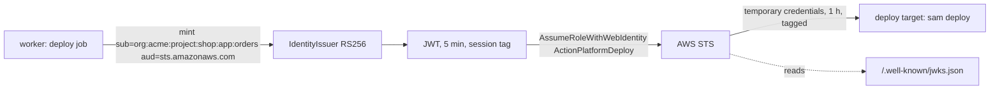
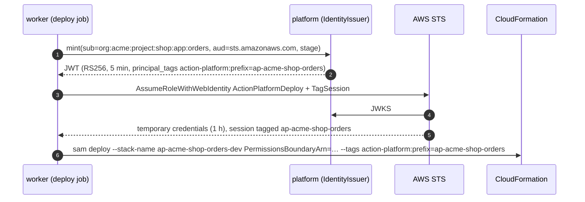

# Identity for deploys — the platform as an OIDC issuer

A deploy needs to be someone to the cloud it talks to. The platform does not keep cloud access keys; it signs a short-lived token that says which organization, project and app the deploy runs for, and the cloud trusts that token the way it trusts GitHub Actions — through OpenID Connect.



## What the platform publishes

- `GET /.well-known/openid-configuration` — issuer (`AP_PUBLIC_URL`), `jwks_uri`, RS256.
- `GET /.well-known/jwks.json` — the public key. The pair is made on first use and kept in `signing_key` with the private half sealed by `AP_AUTH_SECRET`.

Both are open, served through the web app's domain, and what a cloud reads when you register the platform as an identity provider.

## Tokens

| Who asks | Subject | Extra claims |
|---|---|---|
| the worker, for a deploy job | `org:<org>:project:<project>:app:<app>` | `organization`, `project`, `app`, `stage`; for `sts.amazonaws.com`, the session tag below |
| `POST /api/v1/identity/token` — a caller with `app.release` (the CLI on a logged-in machine) | `org:<org>` (`:project:…:app:…` when the body names them) | `organization`, `project`, `app`, `actor` (the user's email), `scopes` (the caller's permissions in the organization) |

`aud` is what the caller asks for (`sts.amazonaws.com`), `exp` five minutes out, `jti` unique. A deploy target reaches the token through `ctx.identity_token(audience)` — None on a machine that is neither the platform nor logged in to one, and the target says so.

## Trusting it on AWS — a connected account

A token for `sts.amazonaws.com` about one app carries the session tag AWS reads from the claim `https://aws.amazon.com/tags`:

```json
"https://aws.amazon.com/tags": {
  "principal_tags": { "action-platform:prefix": ["ap-acme-shop-orders"] }
}
```

The account trusts the platform through the IAM-only connect stack of [apx-aws-lambda](https://github.com/actionplatform/apx-aws-lambda) (`apx_aws_lambda/connect/template.yaml`), created once: an IAM OIDC provider for the platform, the `ActionPlatformAppBoundary` managed policy and one `ActionPlatformDeploy` role. Nothing of the platform runs in the account.



What the account enforces:

- **Trust** — `sub` must be `org:<org>:*` and `aud` `sts.amazonaws.com`; the session may carry only the tag `action-platform:prefix`, with a value `ap-<org>-*`.
- **One role, scoped per app** — the deploy role's policy names every resource through `${aws:PrincipalTag/action-platform:prefix}`: CloudFormation stacks, Lambda functions and layers, log groups, and the execution role. A session tagged for one app reaches nothing of another.
- **Execution roles within the boundary** — the deploy role creates `<prefix>-*` roles only with `ActionPlatformAppBoundary` attached and its own prefix tag, and passes them to Lambda only. The boundary caps what a function may reach by the same tag.
- **Stack names** follow the prefix: the target passes `--stack-name ap-<org>-<project>-<app>-<dev|prod>` itself; `samconfig.toml`'s `stack_name` only matters for a deploy with a repository's own role or the AWS CLI's chain.
- **Who may deploy which app** is the platform's decision: it signs a token about an app only for a job or a caller allowed to release it.

The deploy role's ARN is the one setting the plugin asks for (Plugins → AWS Lambda → Configure → *Deploy role ARN*), stored per organization in `plugin_option` and handed to every deploy job as `AP_AWS_LAMBDA_ROLE_ARN` with `AP_APP=<org>/<project>/<app>`.

`[deploy] role_arn = "…"` in a repository still works for a role of its own: the platform registered once per account as an identity provider, a trust policy on `aud` and `sub`, `sts:AssumeRoleWithWebIdentity` with the same token. The same mechanism serves GCP (workload identity federation) and Azure (federated credentials): a plugin for those reads the same token.

## Why not keys

A stored key is one secret for every app and every stage, valid until someone rotates it, invisible in CloudTrail beyond the user it belongs to. A token per deploy is scoped to one app, expires in minutes, and the cloud logs the `sub` — the audit trail names the app, not a shared account.
