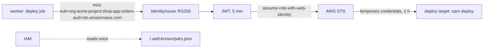

# Identity for deploys — the platform as an OIDC issuer

A deploy needs to be someone to the cloud it talks to. The platform does not keep cloud access keys; it signs a short-lived token that says which organization, project and app the deploy runs for, and the cloud trusts that token the way it trusts GitHub Actions — through OpenID Connect.

## What the platform publishes

- `GET /.well-known/openid-configuration` — issuer (`AP_PUBLIC_URL`), `jwks_uri`, RS256.
- `GET /.well-known/jwks.json` — the public key. The pair is made on first use and kept in `signing_key` with the private half sealed by `AP_AUTH_SECRET`.

Both are open, served through the web app's domain, and what a cloud reads when you register the platform as an identity provider.

## Tokens

| Who asks | Subject | Extra claims |
|---|---|---|
| the worker, for a deploy job | `org:<org>:project:<project>:app:<app>` | `organization`, `project`, `app`, `stage` |
| `POST /api/v1/identity/token` — a caller with `app.release` (the CLI on a logged-in machine) | `org:<org>` (`:project:…:app:…` when the body names them) | `organization`, `project`, `app`, `actor` (the user's email) |

`aud` is what the caller asks for (`sts.amazonaws.com`), `exp` five minutes out, `jti` unique. A deploy target reaches the token through `ctx.identity_token(audience)` — None on a machine that is neither the platform nor logged in to one, and the target says so.

## Trusting it on AWS

Once per account, the platform becomes an identity provider; then one role per app with a trust policy on `aud` and `sub`, and the least-privilege policy the overlay ships in `requirements/policy.json`. [apx-aws-lambda](https://github.com/actionplatform/apx-aws-lambda) has the commands and the policy; `[deploy] role_arn = "…"` in `platform.toml` is the whole configuration on the platform side.

The same mechanism serves GCP (workload identity federation) and Azure (federated credentials): a plugin for those reads the same token.

## Why not keys

A stored key is one secret for every app and every stage, valid until someone rotates it, invisible in CloudTrail beyond the user it belongs to. A token per deploy is scoped to one app, expires in minutes, and the cloud logs the `sub` — the audit trail names the app, not a shared account.
