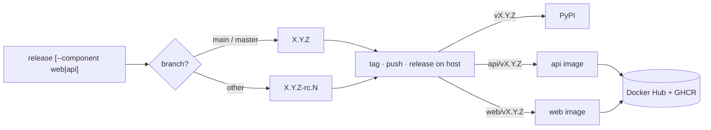

# Releases

One repository, three artifacts, three versions.

| Component | Path | Command | Tag | Publishes |
|---|---|---|---|---|
| library + CLI (root) | `.` | `action-platform release minor` | `v0.3.0` | `action-platform` on PyPI |
| api | `apps/api` | `action-platform release --component api patch` | `api/v0.1.2` | `actionplatformio/action-platform-api` (Docker Hub + GHCR) |
| web | `apps/web` | `action-platform release --component web minor` | `web/v0.2.0` | `actionplatformio/action-platform-web` (Docker Hub + GHCR) |

Declared in `platform.toml`:

```toml
[components.web]
path = "apps/web"

[components.api]
path = "apps/api"
```



## What a release does

1. Refuses a dirty tree, a version that already exists, a tag that exists locally or on `origin`.
2. Computes the next version from `<path>/LAST_VERSION`. Off `main`/`master` (or with `--rc`) it is `X.Y.Z-rc.N`, counting only that component's tags.
3. Renders the changelog from Conventional Commits since the component's last tag, limited to commits that touched `path`; the root excludes every component path.
4. Writes `LAST_VERSION`, prepends `CHANGELOG.md`, syncs `package.json` / `pyproject.toml` / `__version__` under `path`.
5. Commits `chore(release): [<name> ]X.Y.Z`, tags, pushes both, publishes the release on the source host (pre-release when rc). A refused push (the branch moved on the remote meanwhile) deletes the tag and the commit again, so nothing half-published stays in the workspace.

The hosted API syncs the workspace before step 1 (fetch, fast-forward, and a move to the remote when the branch had a leftover local commit), so the push in step 5 is never behind.

`--dry-run` stops after step 3 and prints the version and changelog.

## Workflows

| Workflow | Trigger | Does |
|---|---|---|
| `python-publish-pypi.yml` | release published for `vX.Y.Z` (skips `*/v*`) | builds and uploads to PyPI through a Trusted Publisher (environment `pypi`) |
| `docker-publish-images.yml` (Package Docker) | tag `api/v*` or `web/v*`, or manual dispatch with a component | builds `deploy/Dockerfile.<component>`, pushes `:X.Y.Z` (and `:latest` for stable) to Docker Hub and GHCR |
| `code-quality.yml`, `conventional-commit.yml`, `gitflow.yml`, `trivy.yml` | pull requests and pushes | the shared checks from ci-scripts |

Secrets: `DOCKERHUB_USERNAME`, `DOCKERHUB_TOKEN` (read & write); variable `DOCKERHUB_NAMESPACE` when the Hub account is not `actionplatformio`. GHCR uses `GITHUB_TOKEN`.

## Compatibility

The web app's API client is generated from the API's OpenAPI schema. Ship `api` and `web` together when the contract changes; a web image older than the API it talks to may miss fields, never the other way round is guaranteed.

## Deploys ship releases

A deploy names a version — `action-platform deploy --version X.Y.Z`, the `version` field of `POST /api/v1/apps/{id}/deploy`, the release picked in the web — or takes the tag HEAD sits on; anything else is refused. The tag is checked out for the build and the deploy, so what runs in the cloud is always a commit the release process produced, reproducible from the tag alone.

One deploy at a time per environment: while a deploy (or preflight) to a stage is queued or running, the API refuses another for the same stage with `409` — the stack and the clone are touched by one job at a time; another stage goes ahead. On the platform a deploy never carries a cloud key: the worker signs a token about the app and the target exchanges it for credentials — see [identity](concept_identity.md).

## Readiness

A release carries, per stage, whether it can be deployed there: checked by the worker right after the release is cut, again on request, and stored on the release. Configuration, manifests, credentials, permissions and the destination's state are looked at; nothing is built. A blocked release is refused by the deploy unless forced. The checks, the levels and the gate are in [deployments › readiness](concept_deployments.md#readiness).

## The release table

The platform keeps one row per tag of an app in `release`, whoever named it first: `platform` when the release was cut here, the code host (`github`, `gitlab`, `bitbucket`, or any other importer) when it published one, `git` when the tag simply exists in the clone. The three merge by tag — a host or the platform enriches what git alone knew (name, notes, url, author), git never overrides a host — so a tag always has a row, on GitHub or on a plain git server. Each row carries its `component` and `version` (`web/v1.2.3` → `web`, `1.2.3`), and every [deployment](concept_deployments.md) references the row of the release it shipped.

