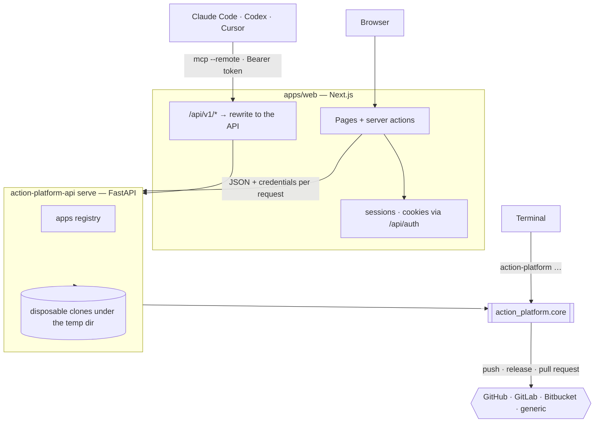
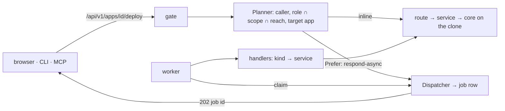
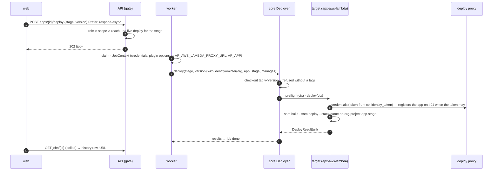
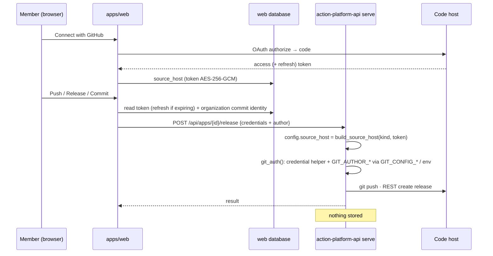
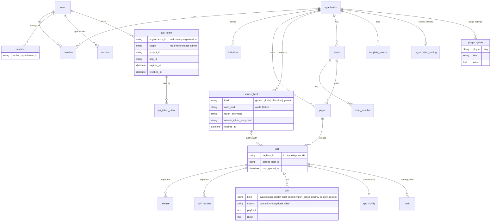

# Architecture



## Packages

```
action_platform/
  core/
    manifest/     Manifest: platform.toml as an object (project, source_host, services; set_source_host, set_deploy_target, set_service)
    scaffold/     store (TemplateSource, TemplateStore: checkouts), templates (Matrix, Leaf, Cloud, Service), detect (LanguageDetector), install (Installer: plan/apply), generate (cookiecutter, overlays, push)
    flow/         repository (Repository: every git command on one clone, follow_remote, stashed), workflow (GitFlow: audit, start, propose, open_pr, install_hooks), gitflow (the rules as pure functions), git (ref/url policy, per-request credentials)
    release/      versioning (Version, VersionFiles), changelog, components, release (Releaser: plan → apply), deploy (Deployer)
    config.py     Config.from_toml → source host, deploy targets, components
    context.py    Context, DeployResult, Diagnosis, PRRef, ReleaseRef
    action_platform.py   ActionPlatform: the facade the CLI, MCP and API call (releaser, deployer, flow)
  providers/
    source/       rest (urllib helper), github, gitlab, bitbucket, generic; build_source_host(kind, …)
  abc/            SourceHost, CIRunner, DeployTarget, WorkingCopy, TemplateStore contracts
  remote/         client (urllib): device-flow login, scoped token exchange, every /api/v1 call; credentials file
  mcp/            server (local or --remote), tools/{matrix,project,flow,lifecycle,remote}, prompts, annotations
  cli/            Typer commands: init install branch gitflow pr release deploy rollback diagnose destroy cloud service mcp login logout whoami
  observability.py   Sentry init shared by the CLI and the API (docs/concept_observability.md)
  hooks/          commit-msg, pre-commit, pre-push, gitflow.sh
apps/web/         the web app: `app/` holds the routes (pages of a few lines), `features/<context>/` the code — projects (list, apps, app view, the wizard), activity, releases, deployments, configuration, templates, organization, integrations (Git, shown on Settings), plugins, account — each with `index.ts` (what pages import), `actions.ts` (server actions) and its tests; `lib/` (the generated OpenAPI client in `lib/api.ts`, its calls grouped per context under `lib/api/{organization,projects,integrations,jobs}.ts` and re-assembled as `v1`) and `components/` are shared. ESLint `no-restricted-imports` keeps pages on a feature's index and features off other features' internals.
deploy/           Dockerfiles, compose, install.sh
apps/api/app/  (package `app`, depends on the library, never the other way round)
  api/            FastAPI: app (factory, AP_API_TOKEN middleware, Sentry), gate (the /api/v1 ASGI gate: body, scope rewrite, threadpool — the decisions live in `services/access/planner`), dependencies (typed: CallerDep, OrgDep, ReleasesDep… so a route declares what it needs), ratelimit, routes — every router, one file per context mirroring the menu: activity, apps, releases, deployments, configuration, templates, jobs, identity; auth/ (sessions, setup, invitations, device), organization/ (members, invitations, identity, settings, sessions = connected apps), integrations/ (hosts, oauth_apps, oauth_flow, github_app, template_sources, plugins), projects/ (projects, apps, organization_import)
  core/           abc (HostProvider, HostDirectory, ImportSource: one implementation per code host), access (the permission rules per route), auth (crypto, jwt, passwords, secrets, cookies — the service is `services/auth`), db (models — one module per context: auth, organization, projects, configuration, activity, integrations, jobs —, database, migrations), shared (clock, ids, urls, http, credentials)
  repositories/   data access by context, each exposing one composed class on a session: workspace (registry rows, drafts, source), configuration (ConfigStore), organization (OrganizationRepository: organizations, members, teams, invitations), projects (ProjectsRepository: projects, apps), integrations (OAuth apps, template sources); `base.DirectoryBase` is the session they share
  services/       access (Caller, Authorizer: role ∩ scope ∩ reach, Dispatcher: async and import jobs, Planner: one /api/v1 call decided, request enrichment, AccessDirectory: the one session composition the gate and the jobs read), projects (service; apps: inventory, scaffolding, remote; organization_import: gateway, preview, the import steps and ImportDirectory — the one place that spans organization, projects and integrations), auth (AuthService: accounts, sessions, first organization, device flow, API tokens), organization (sessions: TokenMinter), workspace (disposable clones, manifest, state, git_auth: credentials applied to a config and to git for one call), activity (git-flow on the clone; imports: one ImportSource per host), releases, deployments (service, env, identity), configuration (service, commit), integrations (hosts: one HostProvider per code host, OAuth state, access report, HostConnector, IntegrationsDirectory: hosts + OAuth apps + template sources on one session; plugins: the bundled ones and their per-organization options), templates (sources: which repository and the matrix view; service; published index), jobs (queue, context, registry — kind → handler, filled by the contexts —, handlers, worker), deploy (the environment a deploy job carries), identity (issuer, signer)
  schemas/        the Pydantic models behind the OpenAPI contract, one module per context (common, auth, organization, integrations, projects, organization_import, apps, activity, releases, deployments, configuration, templates, identity, jobs); routes import from the owning module
  cli/            `action-platform-api serve | worker | db` — the process entry points, the only place that composes services

```

The library has the same shape: `core` reaches plugins only through `core/extensions.py` (a `Protocol` — hooks after release, deploy and pull request; disabled packages; overlay roots) that `action_platform/__init__.py`, the composition root, wires to the plugin registry. Rule of the layers: `api/routes → services → repositories → schemas → core` — enforced by `.importlinter` (`lint-imports` in the code-quality workflow), which also keeps `fastapi` out of services and repositories, `schemas` and `core` free of services, the app contexts `releases`, `deployments` and `templates` independent of one another (a context reaches another only through its package `__init__`; `configuration` uses `templates` that way), the library out of `app`, and `core` off `plugins`/`mcp`/`cli`/`remote`. A service never imports FastAPI: it refuses with a domain error from `core/errors.py` (`Invalid`, `Forbidden`, `NotFound`, `Conflict`, `Gone`, `NeedsInstall`, `Upstream` — every one an `ActionPlatformError` with a `status`), and one exception handler in `api/app.py` (and the gate) turns it into the HTTP answer. The worker runs the same services and sees plain exceptions.

### Objects in the core

Every operation starts from a `Repository` — one clone, every git command as a method, credentials and identity taken from the request context — and layers on top of it:

| Object | Does | Where used |
|---|---|---|
| `Manifest.of(root)` | reads and edits `platform.toml` table by table | install, generate, API configuration |
| `GitFlow(repo)` | `audit()`, `start(kind, code)`, `propose()`, `open_pr()`, `install_hooks()` | CLI `branch`/`pr`/`gitflow`, MCP, API flow |
| `Releaser(config, repo)` | `plan(level)` → `ReleasePlan` (dry run), `apply(plan)`; a refused push undoes commit and tag | CLI/MCP/API release |
| `Deployer(config, repo)` | deploy, rollback, diagnose, destroy through the `[deploy]` targets | CLI/MCP/API deploy |
| `Installer(root, …)` | `plan()` / `apply()`: platform.toml, LAST_VERSION, AGENTS.md, quality config, CI files, hooks | CLI `install`, API import |
| `TemplateStore()` | `official()` and `checkout(source)` clones of template repositories | matrix loading |
| `Version` / `VersionFiles` | semver value object; the files a project declares its version in | releaser |

Rules that need no repository — branch names, commit messages, merge targets — are the `Rules` object in `flow/gitflow.py`, mirrored by `ci-scripts/gitflow.sh` for CI. `ActionPlatform` is the facade the CLI, MCP and API call; it exposes `releaser`, `deployer` and `flow` for one project.

Every process is a class in a slot of `core/wiring.py` (`gitflow_rules`, `gitflow`, `releaser`, `deployer`, `installer`, `scaffolder`); callers write `wired.releaser(config, repo)` and a plugin may put a subclass in the slot. Named providers — deploy targets, CI runners, source hosts, release strategies, changelog renderers — come from entry-point groups (`core/module.py`) and platform.toml picks one by name; the core's own (`semver`, `conventional`) live in `core/release/strategies.py`. `plugins/` discovers the `action_platform.plugins` group, keeps the on/off state, registers tools and commands and calls the lifecycle hooks — see [plugins](use_plugins.md) and [writing a plugin](contribute_plugins.md).

## Contexts

The API and the web app are one deployable each, cut into the same contexts — the menu of the web app is the list. Every layer of the API has a subfolder per context, so a feature is found by its name in every layer, and the layers keep their one concern:

| Context | Owns | `api/routes` | `services` | `repositories` | `schemas` | `core/db/models` | `apps/web/features` |
|---|---|---|---|---|---|---|---|
| Activity | branches, pull requests, imported releases and PRs | `activity.py` | `activity/` (+ `imports/`) | — | `activity.py` | `activity.py` | `activity/` |
| Releases | versions, notes, tags | `releases.py` | `releases/` | — | `releases.py` | — | `releases/` |
| Deployments | deploy, rollback, diagnose, per-app identity and env | `deployments.py` | `deployments/` | — | `deployments.py` | — | `deployments/` |
| Configuration | `platform.toml` in the database, the file as mirror | `configuration.py` | `configuration/` | `configuration/` | `configuration.py` | `configuration.py` | `configuration/` |
| Projects | projects, apps, scaffolding, import of an organization | `projects/`, `apps.py` | `projects/` (+ `apps/`, `organization_import/`) | `projects/` | `projects.py`, `apps.py`, `organization_import.py` | `projects.py` | `projects/` |
| Templates | template sources, the matrix, the published index | `templates.py` | `templates/` | — | `templates.py` | — | `templates/` |
| Organization | members, teams, invitations, settings, connected apps | `organization/` | `organization/` | `organization/` | `organization.py` | `organization.py` | `organization/` |
| Integrations | GitHub, GitLab, Bitbucket (OAuth apps, tokens), template sources, the plugins and their options | `integrations/` | `integrations/` (+ `hosts/`, `plugins/`) | `integrations/` | `integrations.py` | `integrations.py` | `integrations/` (Git, on Settings), `plugins/` |
| Auth | accounts, sessions, device flow, API tokens | `auth/` | `auth/` | — | `auth.py` | `auth.py` | `account/` |
| Identity | the platform as OIDC issuer: JWKS and the short-lived tokens the clouds trust | `identity.py` | `identity/` | — | `identity.py` | — | — |
| Jobs | the queue, the worker, kind → handler | `jobs.py` | `jobs/` | — | `jobs.py` | `jobs.py` | — |

Two folders are not contexts but the glue between them: `services/access` (who calls, what it targets, whether the call becomes a job — the gate's decisions) and `services/workspace` (the disposable clone every app context works on). A context reaches another only through that context's package `__init__` — `AccessDirectory`, `ImportDirectory` and `IntegrationsDirectory` are the compositions that span repositories of several contexts on one session, and they live in the context that needs them.

**Rule: new code goes in the context folder of each layer.** A route in `api/routes/<context>`, its service in `services/<context>`, its data access in `repositories/<context>`, its models in `schemas/<context>.py` and `core/db/models/<context>.py`, its screen in `apps/web/features/<context>`. A new context is a new folder in every layer it touches, added to `routers` in `api/routes/__init__.py` and to the navigation in `apps/web/components/layout/nav.ts`; `.importlinter` and ESLint keep the layers and the contexts apart.

## The API

Every route, the credentials contract and the OpenAPI client are in [api](use_api.md). Two processes share the code and the database: `serve` (FastAPI) answers, `worker` runs what takes time.

### A call through the gate



The Planner (`services/access/planner.py`) is the one place the gate reads the database: who calls, which app, whether the call becomes a job. The Dispatcher refuses a second `deploy` to a stage that already has one live (`409`) and records whether the caller manages the organization — the deploy token then carries `org.manage`, which the cloud side may require to register the app.

### Jobs

| Kind | Queued by | Handler does |
|---|---|---|
| `sync` | `POST apps/{id}/sync` (async) | fetch and rebuild the clone, then import the host's activity |
| `release` | `POST apps/{id}/release` (async) | `Releaser.plan → apply` on the clone, push, publish on the host |
| `deploy` | `POST apps/{id}/deploy` (async) | `Deployer` on the tagged release with the app's identity token and the plugin options as env |
| `push` | `POST apps/{id}/push` (async) | push the clone's branch, then import activity |
| `import` | after a sync, release or push | releases and pull requests copied into the platform's tables |
| `import_github` | the organization import wizard | repositories, teams, people and projects from a GitHub organization |
| `destroy` | `DELETE projects/{p}/apps/{a}?cloud=true` | every stage's stack down through the target, then the app off the platform |
| `destroy_project` | `DELETE projects/{id}?cloud=true` | the same for each app, then the project |

Kinds are registered in `services/jobs/handlers.py` (`register(kind, factory)`); the worker builds the table once with `JobServices` and claims with `SELECT … FOR UPDATE SKIP LOCKED`. A job is one row: kind, status, payload (the enriched body, the organization, the app, the user, `manages`), attempts, result or error — what the Deployments history shows.

### A deploy, end to end



## How credentials travel



1. A member connects a source host (OAuth through `/api/v1/oauth/…`) or pastes a token (`POST /api/v1/hosts`). The API seals it with AES-256-GCM (`api/auth/crypto.py`, key derived from the auth secret through HKDF) and stores it in `source_host`.
2. An app remembers which host it uses (`app.source_host_id`).
3. On a push / release through `/api/v1`, the gate opens the token — refreshing it first through the OAuth app when it expired — and adds it to the request as `credentials {kind, token, username, base_url, owner, author_name, author_email}` before the call reaches the workspace route. The web app never sees a token.
4. The API rebuilds `config.source_host` with that token (`api/core/credentials.py: apply`) and wraps the git calls in `git_auth()`. The credentials go into a `contextvars.ContextVar` that `core/flow/git.git_env()` reads when it spawns git, so they belong to that request only — concurrent requests on other threads never see them and the process environment is never touched. Git receives them as a credential helper through `GIT_CONFIG_COUNT/KEY/VALUE`, so the token never lands in `.git/config` or on a command line, and the host's own helpers (keychain, `gh`) are cleared for that call.
5. Nothing about the call is stored beyond the imported releases and pull requests.

## The web app's data



`user`, `session`, `account`, `verification`, `device_code`, `organization`, `member`, `invitation` were created by better-auth and are now written by the API's `AuthService` (`apps/api/app/core/auth/`), with the same password hashes and cookie signatures so nothing had to be re-issued; `team`, `team_member`, `project`, `app`, `source_host`, `release`, `pull_request`, `template_source`, `organization_setting`, `api_token`, `api_token_client` are the platform's, and `job`, `registry`, `draft`, `oauth_app`, `plugin_option`, `signing_key`, `app_config` the API's own (see [database](concept_database.md)). The web app has no database connection: every table is owned by the API (`apps/api/app/core/db/models/`, one module per context) and migrated by Alembic on boot (`AP_DATABASE_AUTO_MIGRATE`) or by the compose `migrate` service.

## Trust between web and API

The web app holds the session cookie the API signed, asks `GET /api/auth/session` who the caller is, and calls the API's internal routes (`/api/apps/…`) server-side over the private network with the shared secret `AP_API_TOKEN` (`Authorization: Bearer`, constant-time check on every route but `/api/version`). The CLI, MCP and the browser reach the user-facing prefixes — `/api/v1/*` and `/api/auth/*` — through the platform's public address: the web app rewrites those paths to the API unchanged, and the API's gate identifies the caller (a JWT from `action-platform login` carrying user, organization, scope and reach, checked against its `api_token` row; or a session), then applies role ∩ scope ∩ reach before the call reaches a workspace ([API](use_api.md)).
