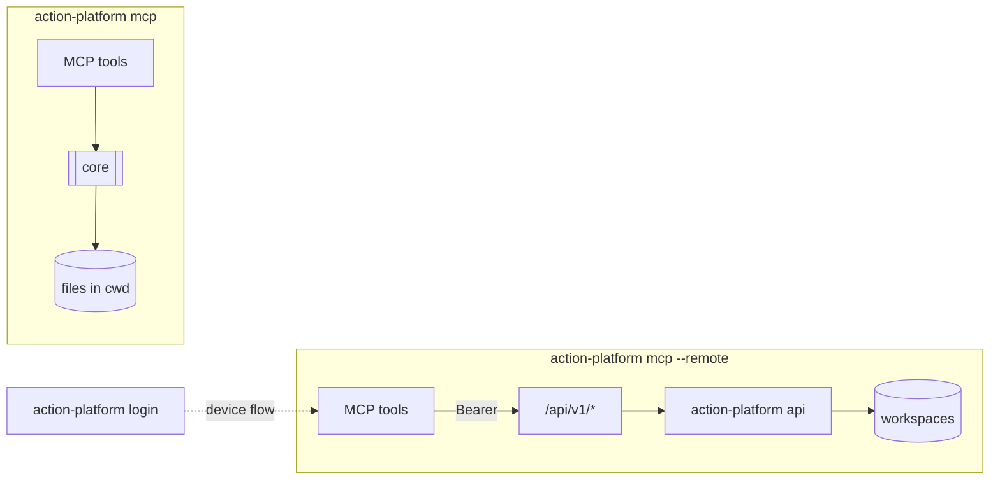

# MCP

The platform ships as an MCP server. Claude Code, Codex, Cursor — anything that speaks MCP — gets 17 tools (`list_matrix`, `init_project`, `install_platform`, `start_branch`, `gitflow_audit`, `propose_pull_request`, `release`, `deploy`, `diagnose`, …), 6 prompts that put them in the right order (`new_service`, `ship_feature`, `cut_release`, `deploy_project`, `adopt_repository`, `fix_gitflow`) and 12 skills that make the agent preview and ask before anything leaves the machine.

```bash
pip install "action-platform[mcp]"
action-platform mcp                 # stdio
action-platform mcp --http          # http://127.0.0.1:8765/mcp
```

Claude Code:

```bash
/plugin marketplace add actionplatform/action-platform
/plugin install action-platform@action-platform
```

Any client — add to `.mcp.json`:

```json
{ "mcpServers": { "action-platform": { "command": "uvx", "args": ["--from", "action-platform[mcp]", "action-platform-mcp"] } } }
```

## Local vs remote



| | `action-platform mcp` | `action-platform mcp --remote` |
|---|---|---|
| Acts on | the current directory and files on this machine | apps on the hosted platform you logged in to |
| Tools | `list_matrix`, `init_project`, `install_platform`, `push_project`, `cloud_set`, `service_add`, `project_info`, `start_branch`, `gitflow_audit`, `install_hooks`, `propose_pull_request`, `open_pull_request`, `release`, `deploy`, `rollback`, `diagnose`, `gitflow_rules` | `whoami`, `list_apps`, `add_app`, `remove_app`, `sync_app`, `app_info`, `gitflow_audit`, `app_commits`, `app_branches`, `app_tags`, `release`, `deploy`, `diagnose`, `list_matrix`, `gitflow_rules` |
| Credentials | your environment | the token from `action-platform login`, sent as `Authorization: Bearer` to `/api/v1/*` on the web app |

Both default `release` and `deploy` to dry runs; the tool descriptions tell the agent to show the result and ask before calling again with `dry_run=false`.

Point Claude Code at a hosted platform:

```json
{ "mcpServers": { "platform": { "command": "action-platform", "args": ["mcp", "--remote"] } } }
```
