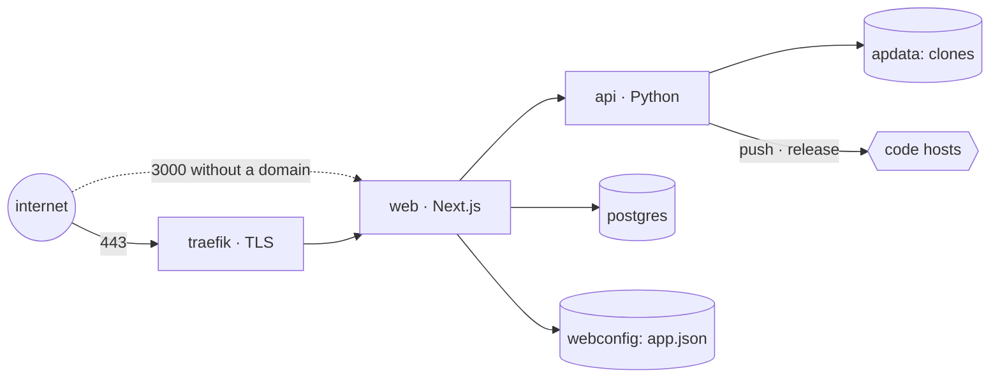

# Self-hosting

Three containers — Postgres, the Python API and the web app — plus a reverse proxy in front of the web app. Everything after `docker compose up` happens in the browser.

## One command

On a fresh Ubuntu/Debian host, as root:

```bash
curl -fsSL https://raw.githubusercontent.com/actionplatform/action-platform/master/deploy/install.sh | sudo sh
```

- installs Docker when missing
- writes `/opt/action-platform/.env` with fresh `POSTGRES_PASSWORD` and `BETTER_AUTH_SECRET`
- `PUBLIC_URL=http://<public ip>:3000`
- `docker compose up -d`, prints the URL

With a domain (DNS `A` record already pointing at the host) Traefik is added and Let's Encrypt issues the certificate:

```bash
curl -fsSL https://raw.githubusercontent.com/actionplatform/action-platform/master/deploy/install.sh | sudo sh -s -- platform.example.com you@example.com
```

Running the script again keeps the existing `.env` and only pulls and restarts — that is the upgrade path.

## Dokploy

Dokploy already runs Traefik, so the compose file has no proxy and publishes no port. Two ways in.

### Template (nothing to type)

`deploy/dokploy/` is a Dokploy template: `template.toml` declares the domain and generates `POSTGRES_PASSWORD` / `BETTER_AUTH_SECRET`; `template.b64` is the two files packed for import.

1. Project → **Create Service → Compose**, any name, *Create*.
2. In the service: **Advanced → Import Template** (or *Raw* → *Import*), paste the contents of [`deploy/dokploy/template.b64`](../deploy/dokploy/template.b64), import. Compose, environment and the `web` domain are filled in; the host is `<app>-<random>.<server ip>.traefik.me` until you change it.
3. **Domains**: edit the host to your domain, HTTPS on. Update `PUBLIC_URL` under *Environment* to match.
4. **Deploy**.

Regenerate `template.b64` after editing the compose or the toml: `sh deploy/dokploy/build.sh`.

### By hand

1. **Create Service → Compose**. Provider *Git*, repository `https://github.com/actionplatform/action-platform`, branch `master`, compose path `deploy/docker-compose.dokploy.yml`.
2. **Environment**: `PUBLIC_URL=https://platform.example.com`, `POSTGRES_PASSWORD`, `BETTER_AUTH_SECRET` (`openssl rand -hex 32` each). Save — the deploy fails with an unhealthy Postgres when these are empty.
3. **Domains → Add**: your host → service `web`, container port `3000`, HTTPS on.
4. **Deploy**. Later upgrades: *Redeploy* pulls `latest`.

## The services



| Service | Image | Notes |
|---|---|---|
| `postgres` | `postgres:16-alpine` | volume `pgdata` |
| `api` | `actionplatformio/action-platform-api` | Python; `AP_HOME=/data` (volume `apdata`: registry + workspaces with the app clones). Only reachable from `web`. |
| `web` | `actionplatformio/action-platform-web` | Next.js standalone; volume `webconfig` for `config/app.json` (OAuth apps, secret). Port 3000. |
| `traefik` | `traefik:v3.3` | only with `--profile tls`; certificates in volume `letsencrypt` |

Images are published for every `api/vX.Y.Z` and `web/vX.Y.Z` tag to Docker Hub and mirrored to GHCR (`ghcr.io/actionplatform/…`). Pin a version with `AP_IMAGE_WEB=actionplatformio/action-platform-web:0.1.2` in `.env`.

## Environment

| Variable | Required | Meaning |
|---|---|---|
| `PUBLIC_URL` | yes | where browsers reach the app; also the OAuth callback origin |
| `POSTGRES_PASSWORD` | yes | Postgres password; `DATABASE_URL` is derived from it in the compose file |
| `ACTION_PLATFORM_GIT_HOSTS` | no | comma-separated hosts the API may clone from (`github.com,gitlab.example.com`; subdomains included). Empty allows any `https://` host. `ssh://`, `git@` and `file://` are always refused for user-supplied URLs; `AP_ALLOW_INSECURE_HTTP=1` admits `http://` for an internal GitLab. |
| `BETTER_AUTH_SECRET` | yes | signs sessions and encrypts stored tokens — rotating it invalidates both |
| `DOMAIN`, `ACME_EMAIL` | with TLS | Traefik host rule and Let's Encrypt account |
| `WEB_PORT` | no | published port (default 3000) |
| `GITHUB_CLIENT_ID/SECRET`, `GITLAB_*`, `BITBUCKET_*` | no | OAuth apps; can also be entered in the UI |
| `ACTION_PLATFORM_TEMPLATES_REPO` | no | templates matrix, default `actionplatform/templates` |

Because `DATABASE_URL` and `BETTER_AUTH_SECRET` come from the environment, the setup wizard skips its database step and starts at the first account.

## Backups

Three volumes hold state: `pgdata` (accounts, organizations, projects, apps, encrypted tokens), `apdata` (app clones — rebuildable from the repositories), `webconfig` (`config/app.json`). Back up `pgdata` and `webconfig`; keep `BETTER_AUTH_SECRET` with them or the tokens cannot be decrypted.

```bash
docker compose exec postgres pg_dump -U action_platform action_platform > backup.sql
docker run --rm -v action-platform_webconfig:/c -v "$PWD":/out alpine tar czf /out/webconfig.tgz -C /c .
```

## Building the images yourself

```bash
docker build -f deploy/Dockerfile.api -t action-platform-api:local .
docker build -f deploy/Dockerfile.web -t action-platform-web:local .
AP_IMAGE_API=action-platform-api:local AP_IMAGE_WEB=action-platform-web:local docker compose -f deploy/docker-compose.yml up -d
```

## Limits today

- The API image ships Python and git only: releases work anywhere; a `deploy` to Lambda / Amplify needs `sam`, `aws` or `node` inside the container, which it does not have yet.
- Domains are set in `.env` (or in Dokploy), not from the app's Settings.
