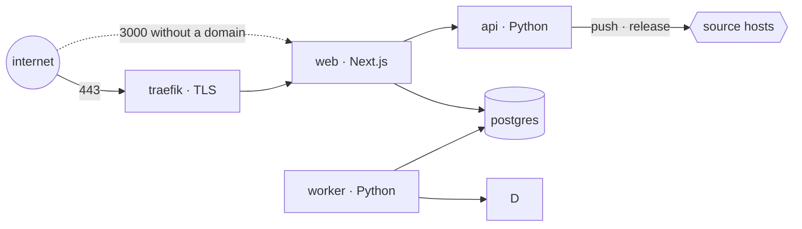

# Self-hosting

Three containers — Postgres, the Python API and the web app — plus a reverse proxy in front of the web app. Everything after `docker compose up` happens in the browser.

## One command

On a fresh Ubuntu/Debian host, as root:

```bash
curl -fsSL https://raw.githubusercontent.com/actionplatform/action-platform/master/deploy/install.sh | sudo sh
```

- installs Docker when missing
- writes `/opt/action-platform/.env` with fresh `POSTGRES_PASSWORD`, `BETTER_AUTH_SECRET` and `AP_API_TOKEN`
- `PUBLIC_URL=http://<public ip>:3000`
- `docker compose up -d`, prints the URL

With a domain (DNS `A` record already pointing at the host) Traefik is added and Let's Encrypt issues the certificate:

```bash
curl -fsSL https://raw.githubusercontent.com/actionplatform/action-platform/master/deploy/install.sh | sudo sh -s -- platform.example.com you@example.com
```

Running the script again keeps the existing `.env` and only pulls and restarts — that is the upgrade path.

## Dokploy

Dokploy already runs Traefik, so the compose file has no proxy and publishes no port. Two ways in.

### Template (nothing to type)

`deploy/dokploy/` is a Dokploy template: `template.toml` declares the domain and generates `POSTGRES_PASSWORD` / `BETTER_AUTH_SECRET` / `AP_API_TOKEN`; `template.b64` is the two files packed for import.

1. Project → **Create Service → Compose**, any name, *Create*.
2. In the service: **Advanced → Import Template** (or *Raw* → *Import*), paste the contents of [`deploy/dokploy/template.b64`](../deploy/dokploy/template.b64), import. Compose, environment and the `web` domain are filled in; the host is `<app>-<random>.<server ip>.traefik.me` until you change it.
3. **Domains**: edit the host to your domain, HTTPS on. Update `PUBLIC_URL` under *Environment* to match.
4. **Deploy**.

Regenerate `template.b64` after editing the compose or the toml: `sh deploy/dokploy/build.sh`.

### By hand

1. **Create Service → Compose**. Provider *Git*, repository `https://github.com/actionplatform/action-platform`, branch `master`, compose path `deploy/docker-compose.dokploy.yml`.
2. **Environment**: `PUBLIC_URL=https://platform.example.com`, `POSTGRES_PASSWORD`, `BETTER_AUTH_SECRET`, `AP_API_TOKEN` (`openssl rand -hex 32` each). Save — the deploy fails with an unhealthy Postgres when these are empty.
3. **Domains → Add**: your host → service `web`, container port `3000`, HTTPS on.
4. **Deploy**. Later upgrades: *Redeploy* pulls `latest`.

## The services



| Service | Image | Notes |
|---|---|---|
| `postgres` | `postgres:16-alpine` | volume `pgdata` |
| `api` | `actionplatformio/action-platform-api` | Python; keeps nothing on disk — clones are made under the container's temp dir when a request needs them and rebuilt from the code host any time. Reachable from `web`, which also forwards `/api/v1` and `/api/auth` to it. |
| `worker` | `actionplatformio/action-platform-api` | same image, `action-platform-api worker`: runs queued syncs, releases, deploys and imports. Stateless like the API: any host, any number — `docker compose up --scale worker=3`. |
| `web` | `actionplatformio/action-platform-web` | Next.js standalone, stateless: pages and server actions over the API. Port 3000. |
| `traefik` | `traefik:v3.3` | only with `--profile tls`; certificates in volume `letsencrypt` |

Images are published for every `api/vX.Y.Z` and `web/vX.Y.Z` tag to Docker Hub and mirrored to GHCR (`ghcr.io/actionplatform/…`). Pin a version with `AP_IMAGE_WEB=actionplatformio/action-platform-web:0.1.2` in `.env`.

## Environment

| Variable | Required | Meaning |
|---|---|---|
| `PUBLIC_URL` | yes | where browsers reach the app; also the OAuth callback origin |
| `POSTGRES_PASSWORD` | yes | Postgres password; `DATABASE_URL` is derived from it in the compose file |
| `ACTION_PLATFORM_GIT_HOSTS` | no | comma-separated hosts the API may clone from (`github.com,gitlab.example.com`; subdomains included). Empty allows any `https://` host. `ssh://`, `git@` and `file://` are always refused for user-supplied URLs; `AP_ALLOW_INSECURE_HTTP=1` admits `http://` for an internal GitLab. |
| `AP_GIT_AUTHOR_NAME`, `AP_GIT_AUTHOR_EMAIL` | no | fallback identity for commits when a request carries none (defaults `Action Platform <cloud@actionplatform.io>`). Each organization sets its own commit identity in Setup and Settings → Commit identity; the web app sends it with every call. |
| `AP_API_TOKEN` | yes | shared secret between web and API: the API refuses every request without `Authorization: Bearer <token>` (except `/api/version`), so a neighbour on the Docker network cannot drive it. Set the same value on both services; unset, the API trusts the network (local development). |
| — | — | A `.env` in the working directory is read on start for every variable the shell did not set (the CLI, the API and the worker alike). |
| `AP_PLUGINS_DIR` | no | A directory the API and the worker share (a volume): plugins installed from the web land there and load without a rebuild. Without it the Plugins page is a catalog only. |
| `AP_DATABASE_URL` | yes | the API's connection to the same Postgres (`postgres://…`, `mysql://…` or `sqlite:///…`). Set, the API runs its migrations on boot and adopts the tables the web app created — see [database](concept_database.md). The compose file derives it from `POSTGRES_PASSWORD`; `AP_DATABASE_POOL_SIZE` (default 10) and `AP_DATABASE_MAX_OVERFLOW` (default 20) size its pool — every request holds one connection and some hold two, so keep the sum below the Postgres `max_connections` shared with the web app and the worker. |
| `AP_ALLOW_UNAUTHENTICATED` | no | `1` lets the API start without `AP_API_TOKEN` — local development only |
| `AP_SENTRY_DSN_API`, `AP_SENTRY_DSN_WEB` | no | Sentry DSNs, one project per component; empty keeps reporting off. Reaches the containers as `AP_SENTRY_DSN` (API) and `SENTRY_DSN` (web); `AP_SENTRY_ENVIRONMENT` / `SENTRY_ENVIRONMENT` and `*_TRACES_SAMPLE_RATE` (default 0.1) tune them. See [observability](concept_observability.md). |
| `BETTER_AUTH_SECRET` | yes | signs sessions, API tokens and encrypts stored tokens — rotating it invalidates all three. The compose files hand it to the API as `AP_AUTH_SECRET`, with `PUBLIC_URL` as `AP_PUBLIC_URL` (the device-flow verification address). |
| `DOMAIN`, `ACME_EMAIL` | with TLS | Traefik host rule and Let's Encrypt account |
| `WEB_PORT` | no | published port (default 3000) |
| `GITHUB_CLIENT_ID/SECRET`, `GITLAB_*`, `BITBUCKET_*` | no | OAuth apps, read by the API; the ones entered in the UI (or created through the GitHub manifest) are stored in the database and win |
| `ACTION_PLATFORM_TEMPLATES_REPO` | no | templates matrix, default `actionplatform/templates` |

The setup wizard's first step only checks that the API has its database and secret; with the compose files it passes at once.

## Backups

One volume holds state: `pgdata` (accounts, organizations, projects, apps, encrypted tokens, OAuth apps, the registry, pending edits, jobs). Back up `pgdata`; keep `BETTER_AUTH_SECRET` with it or the tokens cannot be decrypted. Clones live under the API's and worker's temp dir (`AP_WORKSPACES` to move them, `AP_WORKSPACE_TTL` seconds between fetches, default 15) and can be deleted at any moment.

```bash
docker compose exec postgres pg_dump -U action_platform action_platform > backup.sql
```

## Building the images yourself

```bash
docker build -f deploy/Dockerfile.api -t action-platform-api:local .
docker build -f deploy/Dockerfile.web -t action-platform-web:local .
AP_IMAGE_API=action-platform-api:local AP_IMAGE_WEB=action-platform-web:local docker compose -f deploy/docker-compose.yml up -d
```

## Limits today

- The API image ships Python and git only: releases work anywhere; a `deploy` to Lambda / Amplify needs `sam`, `aws` or `node` inside the container, which it does not have yet.
- Domains are set in `.env` (or in Dokploy), not from the app's Settings.
- Calls run inline unless the client asks for `Prefer: respond-async`; the web app still waits for each action. Queued work is in [database](concept_database.md#jobs).

## Upgrading

Each component ships on its own tag and image: `api/vX.Y.Z` → `actionplatformio/action-platform-api`, `web/vX.Y.Z` → `actionplatformio/action-platform-web`, `vX.Y.Z` → `action-platform` on PyPI ([releases](concept_releases.md)). To upgrade:

1. Pull the new images (`install.sh` again, or *Redeploy* on Dokploy). Start the **api** before or together with the **web**: the web client is generated from the API's schema, so an older API may miss fields a newer web sends.
2. The API applies its migrations on boot (`apps/api/app/core/db/migrations/`); nothing to run by hand. Back up the database first for a major jump.
3. Update the CLI where people use it: `pip install -U action-platform`. Tokens minted by `action-platform login` keep working across upgrades until they expire (90 days) or are revoked.

`GET /api/version` on the API and the sidebar footer in the web app (`web · api · lib`) show what is running.
