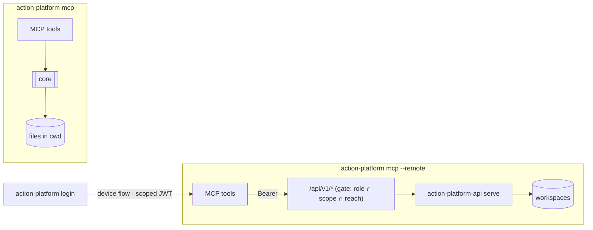

# MCP

The platform ships as an MCP server. Claude Code, Codex, Cursor — anything that speaks MCP — gets 17 local tools (`list_matrix`, `init_project`, `install_platform`, `start_branch`, `gitflow_audit`, `propose_pull_request`, `release`, `deploy`, `diagnose`, …) or 37 remote ones (projects and their apps, configuration, git-flow, releases, plus orientation and organization management), 6 prompts on the local server that put them in the right order (`new_service`, `ship_feature`, `cut_release`, `deploy_project`, `adopt_repository`, `fix_gitflow`) and, from the plugin repository, 14 skills that make the agent preview and ask before anything leaves the machine. Every tool carries an input schema and an output schema (`action_platform/mcp/schemas.py`), and a platform error — a refused permission, an unknown app, a git-flow violation — comes back as the tool's error text, so the agent can read why.

```bash
pip install "action-platform[mcp]"
action-platform mcp                 # stdio
action-platform mcp --http          # http://127.0.0.1:8765/mcp
```

Claude Code — the plugin, its 13 skills and the Codex/Cursor manifests live in [actionplatform/action-platform-mcp](https://github.com/actionplatform/action-platform-mcp):

```bash
/plugin marketplace add actionplatform/action-platform-mcp
/plugin install action-platform@action-platform
```

Any client — add to `.mcp.json`:

```json
{ "mcpServers": { "action-platform": { "command": "uvx", "args": ["--from", "action-platform[mcp]", "action-platform-mcp"] } } }
```

## Local vs remote



| | `action-platform mcp` | `action-platform mcp --remote` |
|---|---|---|
| Acts on | the current directory and files on this machine | apps on the hosted platform you logged in to |
| Tools | `list_matrix`, `init_project`, `install_platform`, `push_project`, `cloud_set`, `service_add`, `project_info`, `start_branch`, `gitflow_audit`, `install_hooks`, `propose_pull_request`, `open_pull_request`, `release`, `deploy`, `rollback`, `diagnose`, `gitflow_rules` | `whoami`, `current_context`, `list_organizations`, `list_projects`, `list_teams`, `list_members`, `create_project`, `delete_project`, `create_team`, `add_team_member`, `assign_project_team`, `set_member_role`, `list_apps`, `add_app`, `init_app`, `remove_app`, `sync_app`, `app_info`, `gitflow_audit`, `app_commits`, `app_branches`, `app_tags`, `app_releases`, `start_branch`, `checkout_branch`, `propose_pull_request`, `open_pull_request`, `read_manifest`, `write_manifest`, `set_cloud`, `add_service`, `commit_changes`, `release`, `deploy`, `diagnose`, `list_matrix`, `gitflow_rules` |
| Templates | official repository, or another one with `source=url[@ref]` | official plus every repository the organization added under Templates; custom entries are addressed by `source=<name>` |
| Permissions | whatever your user can do | your role in the organization (`viewer`, `developer`, `deployer`, `admin`, `owner`) narrowed by the token's scope (`read`, `write`, `release`, `admin`) and reach (one organization or all, optionally one project or app); a refused call names the missing permission or scope |
| Credentials | your environment | the JWT from `action-platform login` (everything your role allows by default; `--scope read` for a read-only assistant, `--scope read,write,release` for one that ships but cannot manage the organization), sent as `Authorization: Bearer` to `/api/v1/*` (the web app forwards the path to the API, whose gate applies the rules); the server also sends the MCP client's name (`clientInfo`) so *Connected apps* can show Claude Code, Codex or Cursor next to the token |

Both default `release` and `deploy` to dry runs; the tool descriptions tell the agent to show the result and ask before calling again with `dry_run=false`. `release` accepts `branch`: stable versions come only from `main`/`master`, any other branch yields `X.Y.Z-rc.N`.

Apps live in projects: `add_app` and `init_app` take a `project` (id or slug from `list_projects`) and answer with `registry_id`, the id every other app tool takes; `remove_app` and `delete_project` leave the repositories on the code host unless `repository` / `repositories` is true — irreversible, so the rules below make the agent ask first.

## Rules the server states

Both servers hand the client the same rules in their instructions, and the skills repeat them:

- git-flow always — no commits on `main`, `master` or `develop`; every change on a `<kind>/<code>[-slug]` branch from `start_branch`; a pull request only after `gitflow_audit` passes and the user approved the `propose_pull_request` preview; Conventional Commits, one commit per concern;
- the platform is reached only through the tools — never its HTTP API, the web app or the code host's API directly (no `curl`, `fetch`, `gh api`, hand-written requests), never its tokens, never `git push` / `gh pr create` / a deploy command to bypass a tool: the tools carry the role, the scope and the audit trail;
- anything that leaves the machine — push, pull request, release, deploy, rollback, removing an app or a project, deleting a repository — is shown first and waits for an explicit yes; dry runs first;
- a refusal is reported with its reason and the agent stops; it does not look for a way around the permission.

Orientation tools on the remote server: `whoami` (account, organization, role, token scope and reach, resulting permissions), `current_context` (matches the local checkout's git remote to a platform app and says what the token may do there), `list_organizations` (every organization with your role and the scopes a token could get), `list_projects` (projects, teams and apps within the token's reach), `list_teams`, `list_members`. When the token spans every organization these take an `organization` argument (id or slug); `list_apps` and `list_projects` answer across all of them without it. An agent asked "what can I do here?" answers from these without guessing. Management tools — `create_project`, `create_team`, `add_team_member`, `assign_project_team`, `set_member_role` — need the matching role (`project.manage` / `org.manage`) and an `admin`-scoped token that is not limited to a project or app.

Remote editing follows the same loop as the web app: `write_manifest` / `set_cloud` / `add_service` change the workspace (the workspace), `commit_changes` commits — on a new `<kind>/<code>` branch with `branch_kind` + `branch_code` when the clone sits on a protected branch — and, with `pull_request=true`, pushes and opens the PR in one call. The web app's `/api/v1` proxy injects the organization's code-host credentials, so private repositories, pushes and pull requests work without any token on the client.

Point Claude Code at a hosted platform:

```json
{ "mcpServers": { "platform": { "command": "action-platform", "args": ["mcp", "--remote"] } } }
```
