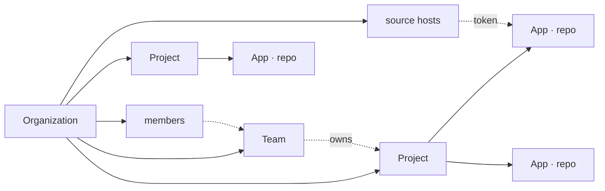
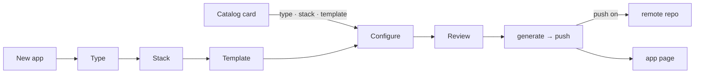

# The web app

Everything the CLI does, from a browser, for a team. The web app is a client of the API: every page reads through it, every action goes through it, and the API decides what you may do. One section per screen, in the order of the sidebar.

Every confirmation is an in-app dialog; the UI is monochrome, and colour appears only on status badges.

## The model



| Level | What it is | Owns |
|---|---|---|
| **Organization** | the tenant; the sidebar switches between the ones you belong to | members, teams, source hosts, projects, plugin settings |
| **Team** | a group of members (`platform`, `payments`) | projects — at most one team per project |
| **Project** | the apps that ship together (`orders-platform`) | apps |
| **App** | one git repository on a code host; the platform clones it when it needs the files and keeps nothing of its own | branches, releases, deployments, configuration |

## First run: the setup wizard

`/setup` opens until an organization exists.

1. **API** — checks the API is reachable and configured.
2. **Admin** — the first account. Public sign-up stays closed afterwards.
3. **Organization** — name and slug.
4. **Source hosts** — connect GitHub / GitLab / Bitbucket, or skip ([Git](#git)).

Running by hand instead of the compose files: the wizard prints the values the API must start with. Migrations and readiness are in [self-hosting](start_self_hosting.md).

## People

A person of the platform shows as their display name wherever they acted — who deployed, who cut a release, who invited; the email only when the account has none (Members lists both on purpose). An account on a code host — the author of a pull request or of a release published there — shows as its login on that host.

## Dashboard

The home of an organization: apps, deployments today (and how many verified), deploys and CI runs failed today, releases this week; the latest events across every app — releases, deployments, CI runs, pull requests — each linking to its tab; and the apps that read no CI yet, linking to *Connect CI*. Read from the database, cached thirty seconds on the API.

## Projects

The organization's projects: search, sort, **Import** ([Import](#import)) and **New project**. A card shows the project's apps and team, with a menu to assign a team or delete. A project being torn down on the cloud says *Tearing down* until it is gone.

### The project page

The project's apps with their language and branch. **New app** opens the wizard; **Add an existing repository** takes a git URL.

### Creating an app



1. **Type** — web, library, docs, plugin, empty
2. **Stack** — filtered by type
3. **Template** — `Default` marks the stack's default; custom templates carry their source name
4. **Configure** — name, description, project, source host and repository owner; CI provider, Docker overlay, push to the remote
5. **Review** — summary plus the equivalent `action-platform init …` command

*Create project* generates the app, creates the repository on the code host, pushes `main` and registers it — an app always lives on a code host, so the wizard needs a connected one. A template card under **Templates** opens the wizard at *Configure* with the first three steps filled in.

### Adding an existing repository

A git URL. With a `platform.toml` the app is registered as it is. Without one, the platform offers to install it: pick the type and CI, and the app opens on Configuration with `platform.toml`, the quality config, the CI files and the hooks as **pending edits** — nothing pushed yet. **Commit changes** puts them on a `chore/<code>` branch with a pull request; **Discard changes** drops them. Pending edits live on the platform, not in a clone: they survive restarts and are applied on top of a fresh clone whenever the app's files are needed.

## The app page

The header carries the name, the branch, **Last synced** and **Sync** (or **Push to remote** while there is none). Tabs: Overview, Activity, CI, Releases, Deployments, Configuration, Settings.

### Overview

Branch, version, latest tag and deploy target; git-flow health of the branch and its commits; last commits, remote branches with their kind, tags; source and automation. Actions live in the other tabs.

### Sync

Fetches the remote and rebuilds the clone on the branch the app is on — the remote is the only source of truth. A branch deleted on the remote (its pull request merged) sends the app back to the default branch. Every request refreshes a stale clone on its own; **Sync** forces it now. Releases and pull requests are then copied from the code host in the background, so they may take a moment to appear.

### Releases

The tab lists the app's releases — version, tag, **Ready** (a badge per scope in green when deployable, red when blocked, grey while checking), author, commit, published — ten per page, paged on the API, with the page size to choose (10, 25, 50, 100); a row's menu opens **Timeline & readiness** — the readiness checks per stage with what failed and how to fix it, a **Re-check** button, then the pull requests merged since the previous tag, the release, the CI runs on the tag and the deployments that shipped it —, opens the release on the host, copies the tag or the SHA, shows the changelog. Readiness runs on the worker right after the release is cut; it looks at configuration, manifests, credentials, permissions and the destination's state and builds nothing — see [deployments › readiness](concept_deployments.md#readiness). **New release** opens its own page: Branch and Version (Patch / Minor / Major as a switch, the resulting version under each), Name and Markdown notes (they go into `CHANGELOG.md` and the release on the code host); a strip shows current → next, tag and kind. **Preview changelog** is the dry run; **Create X.Y.Z** asks to confirm (a Major asks twice) and shows the **release log** while the worker bumps, tags, pushes and publishes.

Refused when the tag exists, the branch is not on the remote, the tree is dirty or the branch policy fails. Off `main`/`master` it is an `-rc.N` pre-release. The model: [releases](concept_releases.md).

### Scopes

A deploy always lands on a **scope**: a named destination of the app with a kind (`web`, `job`, `worker`, `static`, `library`), a criticality (`test`, `low`, `medium`, `high`, `critical`) and a target. The tab lists the app's scopes — name, kind, criticality, what each accepts, target, who runs deploys there; the first look at an app derives them from its configuration (`dev` as `test`, `prod` as `high`, marked *from config*). **New scope** opens its own page: Name, Kind, Criticality (a switch with the definition of each level), Target, Region, Run by, URL. A scope's menu edits or deletes it (refused while a deploy to it is running). Criticality decides which releases a scope takes: `test` and `low` take candidates, stable and hotfix releases; `medium` and above take stable and hotfix. The model: [scopes](concept_scopes.md).

### Deployments

The tab lists the platform's deploys, preflights and tear-downs — status, stage, type, version, duration, who, when — ten per page, paged on the API; a row's menu opens the run — target, version, attempts, started, finished, who; the endpoint with copy and open; the **run log**, following the worker line by line while it runs; the deployment output as JSON — and **Redeploy** in its footer. What arrived at every target of the app, whoever shipped it, is in `GET /api/v1/projects/{p}/apps/{a}/deployments`, `action-platform deployments` and the `list_deployments` tool.

**New deployment** opens its own page: Release (with its shape — candidate, stable, hotfix) and Scope (with its criticality and what it accepts), a strip with target · release · scope · version, and the **readiness** of that release for that scope — *ready*, *blocked* with the failing checks and their fixes, or *not checked yet* — then **Run preflight** (checks only) → **Deploy to <env>**. A blocked release does not deploy until *Deploy anyway* is ticked; the API refuses it the same way (`409`) without `force`. The job runs on the worker and the row lands in the list at once; the form shows the **deploy log** as the worker writes it — `sam build`, `sam deploy`, the core's steps — and keeps it after the run ends. One deploy at a time per environment: the button waits while one is live. A failure shows a compact alert with *View logs* and *Copy error*. Every deployment ships a release — a tag, never a branch. The model: [deployments](concept_deployments.md).

### Activity

The tab lists the app's pull requests — state, title, head → base, author, when — ten per page, paged on the API, from the code host's import. **New pull request** opens its own page: the branch the app is on (switch, or **New branch** for a `<kind>/<code>` one), **Prepare** audits git-flow and drafts the title and body from the commits, **Open pull request** confirms and opens it on the host; the list then shows a banner with the link to review and merge.

### CI

The tab lists the runs imported from the app's CI — status, run, branch, commit, trigger, when, duration, linked to the server — ten per page, paged on the API; **Sync** imports the latest. **Connect CI** (later **Change CI**) opens its own page: the runner — a **CI server** the organization connected under Settings (Jenkins), or the one embedded in the source host (GitHub Actions, GitLab CI, Bitbucket Pipelines, with the host's own token) — and the **job**: the path in the Jenkins URL (`team/app`, `team/app/main` for a multibranch branch), a workflow file such as `ci.yml` for GitHub Actions (empty means every workflow), nothing for GitLab and Bitbucket. **Run** starts the job on a branch or tag — a `workflow_dispatch`, a GitLab pipeline, a Bitbucket pipeline or a Jenkins build — and the run shows after the next sync.

### Configuration

**Deploy target** picks a cloud overlay for the app's type and language and applies it — the files become pending changes and `[deploy] target` is recorded. Services (`action-platform service add`) stay on the CLI until the web has something real to show for them. Both are forms with a summary strip and a confirmation. **Manifest** edits `platform.toml` as the platform keeps it; **Export** writes the mirror into the repository. Pending changes are committed from the bar on top to a `chore/<code>` branch with a pull request, or discarded.

### Deleting

Deleting an app or a project removes it from the platform. The dialog asks for the name and offers:

- **Delete repository on GitHub** (GitLab, Bitbucket) — deleted on the host first; when the host refuses, nothing is removed and the dialog says why. Branches, tags, releases and pull requests go with it; it cannot be undone.
- **Also tear down `<target>`** (app) / **Delete stacks on the cloud** (project) — the stacks are deleted through the target first, then the app or project leaves the platform; a failure leaves it in place with the error on Deployments.

Which hosts can delete, and what a tear down does: [troubleshooting](start_troubleshooting.md#git-hosts) · [deployments](concept_deployments.md#leaving-the-cloud).

## Templates

The catalog: the official repository plus the ones the organization added under **Template repositories** (owners and admins; any git repository is one template, or a whole catalog with an `index.json`). A project card opens the wizard; a cloud card opens *Apply to app*. Sources and overlays: [templates](concept_templates.md).

## Import

**Import** (admins, from Projects) brings a GitHub organization — or the connected account's own repositories — in through a connected GitHub host. Pick the host and the organization; the page lists what the token sees:

- **GitHub Projects** become projects; their repositories become the apps.
- **Repositories** become one project each, or all go into one existing project.
- **Teams** become teams; their members already on the platform join them.
- **People** join at once when an account with that email exists, or receive an invitation; people without a public email are listed for you to invite by hand.

Repositories already on the platform cannot be picked twice. Teams and people need the GitHub App permission *Organization › Members (read)* or the `read:org` scope; the page says so when GitHub refuses. The import runs in the background and ends with what was created and what was skipped, with the reason.

## Organization

Three pages — on a phone, three tabs.

### Teams

Members (organization members only) and projects; a project belongs to at most one team, assigned here or from the project card. Deleting a team leaves its projects without one.

### Members

People, roles and invitations. **Add member** creates the account or attaches an existing one; **Invite** produces a link (valid 7 days, bound to the email) to share — no email is sent. The roles table is on this page; the rules in [access control](concept_access_control.md).

### Sessions

Everything signed in as you (also the key icon next to your name): API tokens across organizations — scope, reach, the programs using them, last used, expiry — and browser sessions, each revocable at once.

## Plugins

One card per plugin the platform runs, with its version. **Configure** opens the settings the plugin declares, kept per organization; a plugin that failed to load shows the error. There is no marketplace: a plugin ships inside the platform's image ([plugins](use_plugins.md)).

**AWS Lambda** asks for the URL of the deploy proxy installed in your AWS account; every deploy of the organization goes through it. Installing the proxy: the [apx-aws-lambda](https://github.com/actionplatform/apx-aws-lambda) README; how it works: [identity](concept_identity.md).

## Settings

**Organization** — name, slug, your role, the commit identity and the git-flow rules — and **Git**.

### Commit identity

Name and email the platform commits with on its clone (releases, configuration), chosen in Setup and editable here. Stored per organization; every commit the platform makes carries it.

### Git

GitHub, GitLab and Bitbucket, connected per organization — organization A can connect a personal account, organization B the company's; nothing is shared.

**GitHub in two clicks**: *Create GitHub App* opens GitHub with the manifest pre-filled; confirm, then *Install the app* on the account or organization whose repositories it should manage, and *Connect with GitHub*. **Install on another organization** adds more accounts later; each one becomes selectable as the repository owner in the wizard. The GitHub App is public, so it installs on any account you administer.

Otherwise register an OAuth app once (*Set up OAuth app* shows the callback URL to paste):

| Provider | Where |
|---|---|
| GitHub | Settings → Developer settings → OAuth Apps (*I already have one*) |
| GitLab | Preferences → Applications, scopes `api write_repository read_user` |
| Bitbucket | Workspace settings → OAuth consumers: account; repositories write/admin; pull requests write |

Then **Connect with …** signs the organization in with your account; the wizard offers your user plus every group (GitLab) or workspace (Bitbucket) you can create in. *Add with a token* is the manual path (kind, base URL for self-hosted instances, token, default owner); *Other* is any git server over HTTPS — push and tag only.

Tokens are encrypted by the API and never leave it; expiring tokens are refreshed before use. The list shows each account, where the app is installed and the default owner the wizard pre-selects; apps remember which host they use. *Webhook…* shows the payload URL and generates the secret (shown once) to paste on the host — GitHub: pushes, pull requests, releases, workflow runs; GitLab: push, tag, merge request, release, pipeline; Bitbucket: push, pull requests — after which every event syncs the app within seconds. *Remove host* disconnects an account.

### CI servers

Build servers of their own, per organization: name, base URL, username and API token (Jenkins → your user → Security → API Token). *Test* reaches the server with the sealed token. GitHub Actions needs nothing here. Apps pick a server and a job from their CI tab; removing a server leaves the imported runs and disconnects the apps that pointed at it.

### Delete organization

At the bottom of Settings, an **owner** can delete the organization: type its slug, choose whether the repositories on the code hosts go too and whether the deploy stacks are torn down first (a job on the worker; the organization leaves when every stack is gone), confirm. Projects, apps, members, teams, invitations, connected hosts, CI servers, template sources, plugin options, tokens and history go with it; sessions pointing at it move to your next organization. `DELETE /api/v1/organizations/{id}?confirm=<slug>&repositories&cloud` is the API.

## CLI and MCP against a hosted instance

```bash
action-platform login https://platform.example.com   # device flow: approve a code at /device
action-platform whoami
action-platform mcp --remote
```

The approval page (`/device`) names the client, shows the code to compare with the terminal, lists the scopes asked for — read, write, release, admin, cut to what your role may grant — and where the token may act: one organization or all of them, optionally one project or one app. An expired code (ten minutes) cannot be approved. What you approve becomes the token's scope and reach; every call then needs both your role and that scope — [access control](concept_access_control.md).

## Old paths

`/settings/people` → `/organization/members` · `/settings/people/teams` → `/organization/teams` · `/integrations`, `/integrations/hosts`, `/settings/integrations` → `/settings` · `/integrations/cloud` → `/plugins` · `/settings/developers`, `/account` → `/organization/sessions`.

## Hardening

Security headers on every response (CSP, HSTS, no framing), no cross-origin cookie-authenticated writes, rate limits on sign-in and device polling, OAuth state bound to the signed-in user, only same-origin redirects, timeouts on every call to a code host and to the API.
