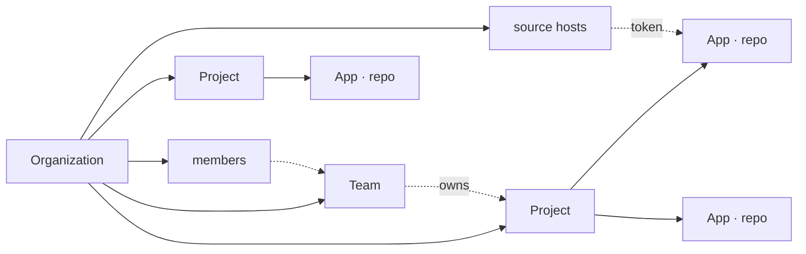
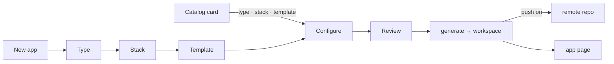

# The web app

`apps/web` — Next.js (App Router) — a stateless client of the Python API: every page reads through `/api/v1`, every server action writes through it, and the API decides what the caller may do. Everything the CLI does, from a browser, for a team.

## Organization › Project › App



| Level | What it is | Owns |
|---|---|---|
| **Organization** | the tenant (better-auth `organization` plugin); the sidebar switches between the ones you belong to | members, teams, source hosts, projects |
| **Team** | a group of organization members (`platform`, `payments`) | projects, at most one team per project |
| **Project** | the apps that ship together (`orders-platform`) | apps |
| **App** | one git repository, cloned by the API into `~/.action-platform/workspaces/<id>` (`/data` in Docker) | git-flow audit, commits, branches, tags, releases, configuration |

## First run: the setup wizard

`/setup` opens until an organization exists.

1. **API** — checks that the Python API has a database and an auth secret (`AP_DATABASE_URL`, `AP_AUTH_SECRET`); nothing to type when the compose files run it.
2. **Admin** — the first account, created by the API. Public sign-up stays closed afterwards. The API must reach the same database with the same secret (`AP_DATABASE_URL`, `AP_AUTH_SECRET`); the compose files wire that, and when running by hand the wizard prints the exact values to start the API with.
3. **Organization** — name and slug.
4. **Source hosts** — connect GitHub / GitLab / Bitbucket, or skip.

Pending migrations run on boot, so upgrading the image is enough.

## Code hosts

Settings → **Connect a code host**.

**GitHub, in two clicks**: *Create GitHub App* opens GitHub with a pre-filled manifest (permissions: contents, workflows, administration, pull requests; callback already set); confirm the name and the app's credentials land in the platform. Then *Install the app on GitHub* on the account or organization whose repositories it should manage, and *Connect with GitHub*. Tokens from a GitHub App expire and are refreshed automatically.

Otherwise each provider needs an OAuth app registered once (GitHub: *I already have one*):

| Provider | Where | Callback |
|---|---|---|
| GitHub | Settings → Developer settings → OAuth Apps | `${PUBLIC_URL}/api/oauth/github/callback` |
| GitLab | Preferences → Applications (scopes `api write_repository read_user`) | `${PUBLIC_URL}/api/oauth/gitlab/callback` |
| Bitbucket | Workspace settings → OAuth consumers (account; repositories write/admin; pull requests write) | `${PUBLIC_URL}/api/oauth/bitbucket/callback` |

The *Set up OAuth app* dialog shows the callback URL to paste and stores the client id/secret in the database (`oauth_app`, secret sealed), or the API reads them from `GITHUB_CLIENT_ID` / `GITHUB_CLIENT_SECRET` etc. Then **Connect with …** sends the member to the provider and comes back with a host named after the account (`GitHub · fernando`), owner defaulting to that login. GitLab and Bitbucket tokens expire and are refreshed before use.

*Add with a token* is the manual path: kind, base URL for self-hosted instances, username where the provider needs one, token, default owner. *Other* is any git server over HTTPS (push and tag only — no releases, no pull requests).

Tokens are sealed by the API (AES-256-GCM, key derived from the auth secret) and opened only inside it, when a call through `/api/v1` needs them; the web app never holds one.

## Templates

The catalog merges the official repository with the ones the organization added. **Template repositories** at the top of the page lists each source with its URL, ref and counts; owners and admins add or remove repositories there — any git repository works and becomes one template (a copy of its tree), or a whole catalog when it has an `index.json`. Custom templates carry their source name on the card, in the wizard and in Configuration → Deploy target, and are generated from their own repository. Cloud cards open *Apply to app*.

## Creating an app



**Projects → project → New app**, or a template card under **Templates** (which opens the wizard at *Configure* with type, stack and template filled in).

1. **Type** — web, library, docs, plugin, empty
2. **Stack** — filtered by type
3. **Template** — the `Default` badge marks the stack's default
4. **Configure** — project name (directory and package name follow it), description, project, source host and repository owner; options: git init, CI provider, Docker overlay (when the template supports it), push to the remote
5. **Review** — summary plus the equivalent `action-platform init …` command

*Create project* generates the app into a workspace on the API, registers it, and — when *push* was on — creates the repository on the host and pushes `main`. Without push, the app page offers **Push to remote** later.

**Add an existing repository** on the project page takes a git URL; the API clones it (it must already contain a `platform.toml` — run `action-platform install` there first).

### Importing a repository without the platform

Project → **Add an existing repository** with any git URL. When the repository has no `platform.toml` the platform offers to install it: pick the type and CI, and the workspace receives `platform.toml`, `.code_quality/`, the CI files and the git hooks (the language is detected). Nothing is pushed — the app opens on Configuration with the changes uncommitted, and **Commit changes** puts them on a `chore/<code>` branch with a pull request. Opening a pull request lands on **Activity** with a banner naming it: the changes are not on the default branch until someone reviews and merges it on the source host, and the next sync brings the result back.

**Discard changes** resets the clone to `HEAD` and deletes untracked files. On an imported app whose platform files were never committed that removes `platform.toml` too — and the next request puts it back: every API call that opens a clone installs the platform files again when they are missing (type `web`, language detected, CI matching the host), uncommitted, so the app never shows an error for something the platform can fix itself. `POST /api/apps/{id}/install` does the same with an explicit type, language and CI.

## The app page

- **Sync** (`git fetch` + fast-forward) or **Push to remote** while there is none
- git-flow audit of the current branch and its commits
- commits, remote branches with their git-flow kind, tags
- **Release**: level → *Preview* (dry run: next version and changelog) → *Release* dialog → tag, push, release on the host. Off `main`/`master` it is an `-rc.N` pre-release.
- **Activity**: git-flow (start a `<kind>/<code>` branch, check out a branch, propose and open a pull request) and the pull requests stored for the app (state, merged date, head → base).
- **Configuration**: pick a deploy target (applies the cloud overlay from the templates repository), add a service, edit `platform.toml`. Edits stay in the workspace until **Commit changes** (Conventional Commit, optional push, optional pull request). On `main`/`master`/`develop` the dialog requires a new `<kind>/<code>` branch: the changes are stashed, the branch starts from the right base, the commit lands there, and a pull request is opened when asked.
- **Sync** does `git fetch --prune --tags` + fast-forward in the workspace (skipped when the branch has no upstream). Uncommitted changes are stashed around the pull and put back; a branch whose remote counterpart was deleted (its pull request merged) is left for the default branch; local commits that the remote already has under another hash are dropped in favour of the remote. A branch with local commits the remote does not have is moved to the remote as well, keeping uncommitted work: the remote is the source of truth and such a commit is only ever a leftover from a failed push. `POST /api/apps/{id}/sync {reset: true}` forces the same from a client. It then imports releases and pull requests from the source host into the `release` and `pull_request` tables (upsert by tag / number). Adding an app, releasing and opening a pull request run the same import. **Last synced** is stored per app and shown in the header.

Deploying is done by the CI of the repository (see [templates](concept_templates.md)), not by the web app.

**Deleting** an app or a project removes it from the platform and deletes the platform's clones; the repositories on the code host stay. The confirmation dialog offers **Also delete the repository** (`?repository=true` on `DELETE /api/v1/projects/{id}/apps/{app}`, `?repositories=true` on `DELETE /api/v1/projects/{id}`): the repository is then deleted on the host through the code host attached to the app, before anything is removed on the platform — when the host cannot delete it, nothing is removed and the dialog says why. A GitHub App created by the setup wizard can delete (its *Administration* permission); a GitHub OAuth host connected before this option existed has no `delete_repo` scope and must be reconnected; a Bitbucket consumer needs the *repositories: delete* permission. Deleting a repository also deletes its branches, tags, releases and pull requests on the host, and cannot be undone.

Every confirmation is an in-app dialog; the UI is strictly monochrome.

## Import

**Import** (admin role) brings a GitHub organization — or the connected account's own repositories — into the current organization through a connected GitHub host. Pick the host and the organization; the page lists everything the token sees:

- **Repositories** become one project each, with the repository as its app (cloned into a workspace, releases and pull requests imported). Repositories already on the platform are marked and cannot be picked twice.
- **Teams** become teams with the same name; their GitHub members who are already members of the organization join them, and the projects of their repositories are assigned to them. An existing team with the same name is updated instead.
- **People** become members right away when an account with the same email exists on the platform, or receive an invitation (with the role picked on the page) when GitHub shows a public email; people without a public email are listed as such and must be invited by hand.

The import runs as a job (`POST /api/v1/import/github` answers `202` with `poll`); the page follows it and ends with a summary of what was created and what was skipped, with the reason. `GET /api/v1/import/github/organizations?host=<id>` and `GET /api/v1/import/github/organizations/{login}?host=<id>` are the preview calls behind the page.

## Settings

Organization members, source hosts (add, update token, remove), the API URL and the git-flow rules.

### Commit identity

Releases and configuration commits are made by the platform on its clone, signed with the organization's commit identity — name and email chosen in Setup (default `Action Platform <cloud@actionplatform.io>`) and editable under Settings → **Commit identity**. Stored per organization in `organization_setting`. The web app sends it on every request that may commit — with the code-host token when the app has one, alone otherwise (`credentials.author_name/author_email`) — so a local commit without a push carries it too; the API's `AP_GIT_AUTHOR_*` only apply when nothing arrives.

### Roles

Five roles — `owner`, `admin`, `deployer`, `developer`, `viewer` — over six permissions; the matrix is in Settings → **Roles and permissions** and explained in [access control](concept_access_control.md).

### Code hosts per organization

Every organization connects its own accounts: **Connect with GitHub** in organization A can be a personal account, in organization B the company's GitHub organization — nothing is shared between them. The GitHub App created from Settings is public, so it can be installed on any account or organization you administer (an app created earlier as private must be made public under GitHub → Settings → Developer settings → GitHub Apps → Advanced, otherwise GitHub only offers the account that created it). There is one connection per GitHub user; **Install on another organization** installs the GitHub App on more accounts or organizations. Each one becomes selectable as the **Organization** that owns the repository when creating an app (the wizard lists every account the app is installed on with permission to create repositories, with a link to install it elsewhere). **Source hosts** shows the login, where the app is installed, and the *default owner* the wizard pre-selects. Apps remember which host they use.

GitLab and Bitbucket work the same way with one OAuth application registered once (Settings → *Set up OAuth app*): **Connect with GitLab** signs the organization in with your GitLab user, and the wizard offers your user plus every group you can create projects in (Bitbucket: every workspace) as the namespace that owns the new repository.

### Members and invitations

Owners and admins add people from Settings → **Members**: **Add member** creates the account (name, email, password) or attaches an existing one; **Invite** produces a link instead. No email is sent: the dialog produces a link (`/invite/<id>`, valid 7 days, bound to that address) to share. Opening it lets the person sign in or create an account and join with the invited role. 

### Teams

**Teams** in the sidebar. A team has members (organization members only) and projects; a project belongs to at most one team, assigned from the team page or from the project card's menu. Deleting a team leaves its projects without one.

### Connected apps

The key icon next to your name opens **Connected apps** (`/account`): your API tokens across organizations — name (`user@host`), scope, reach, the programs that used them (Claude Code, Codex, Cursor, the CLI…), created, last used, expiry — and the browser sessions signed in as you, each with a revoke action. Revoking a session logs that browser out at once. How tokens work: [access control](concept_access_control.md).

## CLI and MCP against a hosted instance

Approving a device code (`/device`, a full-page card outside the app shell) names the client (CLI or MCP), shows the code to compare with the terminal (with a copy button), lists the scopes the client asked for — read, write, release, admin — as a fixed set to approve or deny as a whole, and where the token may act: one organization (or **All organizations** you belong to), optionally one project, optionally one app. Scopes your role in that organization cannot grant are marked *Not available for your role* — a viewer can only hand out `read`, a developer `read` and `write`, a deployer adds `release`, admins and owners everything — and the server clamps the request the same way. Approving asks for confirmation; an expired code (ten minutes) cannot be approved and says so. What you approve becomes the token's scope and reach; a token limited to a project or app sees only that app in `/api/v1/apps` and cannot add apps. A token spanning every organization checks your role in the organization each request touches — the app's own for app routes; `X-Organization: <id or slug>` (or `?organization=`) for organization-level routes, which `GET /projects` and `GET /apps` can also answer across all of them. Every `/api/v1` call then needs both your role and the token's scope: a `developer` with a `release` token still cannot release, and an `owner` with a `read` token can only look.

```bash
action-platform login https://platform.example.com   # device flow: approve a code at /device
action-platform whoami
action-platform mcp --remote
```

Requests go to `/api/v1/*` with `Authorization: Bearer <token>`; the web app forwards that path unchanged to the Python API (a Next.js rewrite), whose gate identifies the caller and applies role, scope and reach ([API](use_api.md)).

## Hardening

The web app sends security headers on every response (CSP, HSTS, `X-Frame-Options: DENY`, `X-Content-Type-Options`, `Referrer-Policy`, `Permissions-Policy`), refuses cross-origin cookie-authenticated writes to `/api/v1`, rate-limits sign-in and device polling, binds every OAuth `state` to the signed-in user, only follows same-origin `next`/`return` paths, and times out every call to a code host (15 s) and to the API (120 s).
