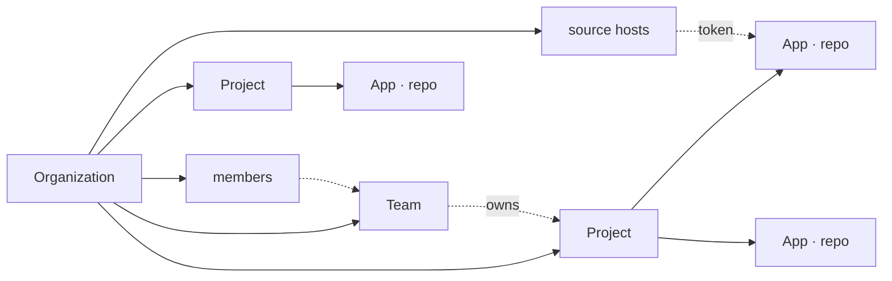
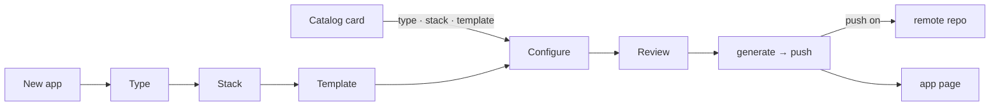

# The web app

`apps/web` — Next.js (App Router) — a stateless client of the Python API: every page reads through `/api/v1`, every server action writes through it, and the API decides what the caller may do. Everything the CLI does, from a browser, for a team.

One section per screen, in the order of the sidebar: **Projects**, **Templates**, **Organization** (Teams, Members, Sessions), **Plugins**, **Settings** — after the model and the first run. Every confirmation is an in-app dialog; the UI is monochrome, and red, yellow and green appear only on status badges.

## The model



| Level | What it is | Owns |
|---|---|---|
| **Organization** | the tenant (better-auth `organization` plugin); the sidebar switches between the ones you belong to | members, teams, source hosts, projects, plugin options |
| **Team** | a group of organization members (`platform`, `payments`) | projects, at most one team per project |
| **Project** | the apps that ship together (`orders-platform`) | apps |
| **App** | one git repository on a code host; the API clones it into a disposable directory whenever a request needs its files and keeps nothing of its own | git-flow audit, commits, branches, tags, releases, deployments, configuration |

## First run: the setup wizard

`/setup` opens until an organization exists.

1. **API** — checks that the Python API has a database and an auth secret (`AP_DATABASE_URL`, `AP_AUTH_SECRET`); nothing to type when the compose files run it.
2. **Admin** — the first account, created by the API. Public sign-up stays closed afterwards. The API must reach the same database with the same secret; the compose files wire that, and when running by hand the wizard prints the exact values to start the API with.
3. **Organization** — name and slug.
4. **Source hosts** — connect GitHub / GitLab / Bitbucket, or skip ([Git](#git)).

The compose files run migrations in a one-shot `migrate` service the API and the worker wait for (`action-platform-api db migrate`); with `AP_DATABASE_AUTO_MIGRATE=0` neither process migrates on boot, and `GET /api/version` answers `ready: false` / `database: behind` until the schema is at head. Without that variable (a plain `pip install`, development) each process still migrates on boot, serialized on PostgreSQL by an advisory lock.

## Projects

The list of the organization's projects: search, sort, **Import** (GitHub organizations, see [Import](#import)) and **New project**. A card shows the project's apps, its team and a menu — assign to a team, delete. A project being torn down on the cloud says *Tearing down* and the list refreshes until it is gone.

### The project page

The project's apps, each with its language and branch; the list refreshes on its own while an app is being added or removed. **New app** opens the wizard; **Add an existing repository** takes a git URL.

### Creating an app



1. **Type** — web, library, docs, plugin, empty
2. **Stack** — filtered by type
3. **Template** — the `Default` badge marks the stack's default; custom templates carry their source name
4. **Configure** — project name (directory and package name follow it), description, project, source host and repository owner; options: git init, CI provider, Docker overlay (when the template supports it), push to the remote
5. **Review** — summary plus the equivalent `action-platform init …` command

*Create project* generates the app, creates the repository on the selected code host, pushes `main` and registers it: an app on the platform always lives on a code host, so the wizard needs a connected host. A template card under **Templates** opens the wizard at *Configure* with type, stack and template filled in.

### Adding an existing repository

**Add an existing repository** on the project page takes a git URL; the API clones it to read it.

- With a `platform.toml`: the app is registered as it is.
- Without one: the platform offers to install it — pick the type and CI, and the app receives `platform.toml`, `.code_quality/`, the CI files and the git hooks (the language is detected) as pending edits. Nothing is pushed: the app opens on Configuration with the changes pending, and **Commit changes** puts them on a `chore/<code>` branch with a pull request. The app then lands on **Activity** with a banner naming it; the changes reach the default branch when someone merges on the source host, and the next sync brings the result back.

Pending edits are not files in a clone: they are rows in the `draft` table (path and content), written on top of a fresh clone by every request that needs the app's files, so they survive restarts and are the same on every instance and worker. **Discard changes** deletes them. On an imported app whose platform files were never committed, every request that opens a clone puts them back as pending edits (type `web`, language detected, CI matching the host) — the app never shows an error for something the platform can fix itself. `POST /api/apps/{id}/install` does the same with an explicit type, language and CI.

## The app page

The header carries the app's name, branch, **Last synced**, and **Sync** — or **Push to remote** while there is none. Tabs: Overview, Releases, Deployments, Activity, Configuration, Settings.

### Overview

Only shows: branch, version, latest tag and deploy target; git-flow health of the current branch and its commits; the last commits, remote branches with their git-flow kind, tags; source and automation. Actions live in the other tabs.

### Sync

**Sync** fetches the remote and rebuilds the clone on the branch the app is checked out on — the remote is the only source of truth, so nothing local can diverge from it; a branch deleted on the remote (its pull request merged) sends the app back to the default branch. Every request does the same on its own when the clone is older than `AP_WORKSPACE_TTL` seconds; **Sync** forces it now. `POST /api/apps/{id}/sync {reset: true}` also drops the pending edits.

Sync then queues an `import` job: the worker copies releases and pull requests from the source host into the `release` and `pull_request` tables (upsert by tag / number) right after the answer, never on the request's clock. Adding an app, releasing and opening a pull request queue the same import.

### Releases

**Create release**, in two columns: on the left the release branch (with its protection) and the version increment Patch / Minor / Major with current → next; on the right the release name (`Release X.Y.Z` unless you change it) and Markdown release notes, which go under the entry's heading in `CHANGELOG.md` and on the code host, above the generated commit list. **Preview changelog** is the dry run; **Create release X.Y.Z** opens the confirmation (a Major asks twice).

Refused when the tag exists, the branch is not on the remote, the tree is dirty or the branch policy fails. Off `main`/`master` it is an `-rc.N` pre-release, never marked latest. **Release history** lists the releases with a menu per row: open on the host, copy tag or SHA, view changelog. The model is in [releases](concept_releases.md).

### Deployments

**Deploy**: a release (every deploy ships a tag; no releases means no deploy), an environment `dev` or `prod` → **Run preflight** (dry run: the target checks credentials and the template, nothing changes) → **Deploy to <env>** dialog. Both run as a job on the worker (`POST /api/v1/apps/{id}/deploy` with `X-Async: 1`, `version` set), which signs an identity token for the app so a target such as `aws/lambda` gets its credentials from the cloud — the platform stores none.

One deploy at a time per environment: while a deploy or preflight to a stage is queued or running the button waits and says why (the API answers `409`), and the row is in the history the moment the job is queued. A failure shows as a compact alert (summary, *View logs*, *Copy error*); the full output stays behind the chevron.

**Target** summarizes `[deploy]` from `platform.toml` — target, region, the app's `org/project/app`; how credentials are obtained is the plugin's business ([Plugins](#plugins)).

**Deployment history** lists the last twenty runs (`GET /api/v1/jobs?app=…&kind=deploy`, plus the `destroy` jobs as *Tear down*): status (Successful, Running, Failed), stage, type, version, duration, who, when; a row expands into the summary, logs, run id, timestamps, *View details* and *Redeploy*. Needs `app.release`. The repository's own CI can still deploy on its own ([templates](concept_templates.md)); the two are independent. Stages, jobs and teardown are explained in [deployments](concept_deployments.md).

### Activity

Git-flow: start a `<kind>/<code>` branch, check out a branch, propose and open a pull request; and the pull requests stored for the app (state, merged date, head → base).

### Configuration

- **Deploy target** — pick one; applies the cloud overlay from the templates repository.
- **Services** — add a service from the catalog.
- **Configuration** — the tables of `platform.toml`, kept by the platform; saving takes effect at once. The badge says whether the repository's `platform.toml` matches, and **Export to repository** writes it into the clone.

Overlay files and exports stay pending until **Commit changes** (Conventional Commit, always pushed, optional pull request). On `main`/`master`/`develop` the dialog requires a new `<kind>/<code>` branch: the branch starts from the right base, the commit lands there, is pushed, and a pull request is opened when asked; the app is then checked out on that branch. See [platform.toml](concept_manifest.md).

### Deleting

Deleting an app or a project removes it from the platform and deletes the platform's clones; by default the repositories on the code host and the stacks on the cloud stay. The dialog asks for the name to be typed and offers:

- **Delete repository on GitHub** (GitLab, Bitbucket; `?repository=true` on `DELETE /api/v1/projects/{id}/apps/{app}`, `?repositories=true` on `DELETE /api/v1/projects/{id}`) — the repository is deleted on the host through the code host attached to the app, before anything is removed on the platform; when the host cannot delete it, nothing is removed and the dialog says why. A GitHub App created by the setup wizard can delete (its *Administration* permission); a GitHub OAuth host connected before this option existed has no `delete_repo` scope and must be connected again; a Bitbucket consumer needs the *repositories: delete* permission. Deleting a repository also deletes its branches, tags, releases and pull requests on the host, and cannot be undone.
- **Also tear down `<target>`** on an app with a deploy target (`?cloud=true`) — the API answers 202 with a `destroy` job; the worker deletes every stage's stack through the target (`sam delete` for `aws/lambda`, then the app leaves the deploy proxy when the caller manages the organization), and only then removes the app. The job shows on Deployments as *Tear down*; a failure leaves the app in place with the error.
- **Delete stacks on the cloud** on a project (`?cloud=true` on `DELETE /api/v1/projects/{id}`) — one `destroy_project` job tears every app's stacks down, then removes the project; the card says *Tearing down* meanwhile.

## Templates

The catalog merges the official repository with the ones the organization added. **Template repositories** at the top of the page lists each source with its URL, ref and counts; owners and admins add or remove repositories there — any git repository works and becomes one template (a copy of its tree), or a whole catalog when it has an `index.json`. Custom templates carry their source name on the card, in the wizard and in Configuration → Deploy target, and are generated from their own repository. A project card opens the wizard; a cloud card opens *Apply to app*. Sources and overlays: [templates](concept_templates.md).

## Import

**Import** (admin role, from Projects) brings a GitHub organization — or the connected account's own repositories — into the current organization through a connected GitHub host. Pick the host and the organization; the page lists everything the token sees:

- **GitHub Projects** (Projects v2) become platform projects with the same name; the repositories linked to a project become its apps. Needs the GitHub App permission *Organization › Projects (read)* or the `read:project` scope.
- **Repositories** become one project each, with the repository as its app (cloned to read it, releases and pull requests imported) — or all go into one existing project picked on the page. Repositories already on the platform are marked and cannot be picked twice.
- **Teams** become teams with the same name; their GitHub members who are already members of the organization join them, and the projects of their repositories are assigned to them. An existing team with the same name is updated instead.
- **People** become members right away when an account with the same email exists on the platform, or receive an invitation (with the role picked on the page) when GitHub shows a public email; people without a public email are listed as such and must be invited by hand.

Listing teams and people needs the GitHub App permission *Organization › Members (read)* — apps created before it was in the manifest must add it under the app's settings on GitHub, and the organization must accept the new permission — or an OAuth token with `read:org`; the page says so when GitHub refuses. The import runs as a job (`POST /api/v1/import/github` answers `202` with `poll`); the page follows it and ends with a summary of what was created and what was skipped, with the reason. `GET /api/v1/import/github/organizations?host=<id>` and `GET /api/v1/import/github/organizations/{login}?host=<id>` are the preview calls behind the page.

## Organization

Three pages — on a phone, three tabs.

### Teams

A team has members (organization members only) and projects; a project belongs to at most one team, assigned from the team page or from the project card's menu. Deleting a team leaves its projects without one.

### Members

The people, their roles, the invitations and the roles table. Owners and admins add people: **Add member** creates the account (name, email, password) or attaches an existing one; **Invite** produces a link instead. No email is sent: the dialog produces a link (`/invite/<id>`, valid 7 days, bound to that address) to share. Opening it lets the person sign in or create an account and join with the invited role.

Five roles — `owner`, `admin`, `deployer`, `developer`, `viewer` — over six permissions; the matrix is on the page and explained in [access control](concept_access_control.md).

### Sessions

Everything signed in as you — the key icon next to your name opens it (`/organization/sessions`):

- **API tokens** across organizations — name (`user@host`), scope, reach, the programs that used them (Claude Code, Codex, Cursor, the CLI…), created, last used, expiry.
- **Browser sessions** signed in as you, each with a revoke action; revoking one logs that browser out at once.
- The API base URL, version and docs.

How tokens work: [access control](concept_access_control.md); approving one: [CLI and MCP](#cli-and-mcp-against-a-hosted-instance).

## Plugins

The hosted platform ships with the plugins it runs — `apx-aws-lambda` is a dependency of the API image, so the `aws/lambda` deploy target, its overlay and tools are always there. There is no marketplace and nothing installs at runtime; a plugin joins the platform as a dependency of the image ([plugins](use_plugins.md)).

One card per plugin, with its version and, when the plugin declares options (`Plugin.options` — [writing a plugin](contribute_plugins.md)), **Configure**: a modal drawn from that declaration, whose values land in `plugin_option` per organization (`org.manage`). A plugin that failed to load shows the error on its card.

### AWS Lambda

**Configure** keeps the URL of the deploy proxy installed in the organization's AWS account (`plugin_option` of `aws-lambda`, key `proxy_url`); `action-platform aws-lambda proxy health <url>` checks it from a terminal. Every deploy job carries it as `AP_AWS_LAMBDA_PROXY_URL` with `AP_APP` = `org/project/app`, so an app whose `platform.toml` says only `target = "aws/lambda"` deploys through the proxy; `proxy_url` in a repository overrides it. An app the proxy does not know yet is registered on its first deploy by an organization manager; anyone else is told to ask one. The worker passes every plugin option the same way (`AP_<SLUG>_<KEY>`), so other targets are configured here too. Installing the proxy: the [apx-aws-lambda](https://github.com/actionplatform/apx-aws-lambda) README; how the token becomes credentials: [identity](concept_identity.md).

## Settings

**Organization** — name, slug, your role, **Commit identity** and the git-flow rules — and **Git**.

### Commit identity

Releases and configuration commits are made by the platform on its clone, signed with the organization's commit identity — name and email chosen in Setup (default `Action Platform <cloud@actionplatform.io>`) and editable here. Stored per organization in `organization_setting`. The API's gate attaches it to every `/api/v1` call that may commit, together with the code-host token when the app has one (`credentials.author_name/author_email`), so every commit carries it; the API's `AP_GIT_AUTHOR_*` only apply to an organization that set none. The web app never handles either.

### Git

GitHub, GitLab and Bitbucket, connected per organization: **Connect GitHub** (or GitLab, Bitbucket). The OAuth flows come back to `/settings`; the GitHub import starts from here too.

**GitHub, in two clicks**: *Create GitHub App* opens GitHub with a pre-filled manifest (permissions: contents, workflows, administration, pull requests, organization members; callback already set); confirm the name and the app's credentials land in the platform. Then *Install the app on GitHub* on the account or organization whose repositories it should manage, and *Connect with GitHub*. Tokens from a GitHub App expire and are refreshed automatically.

Otherwise each provider needs an OAuth app registered once (GitHub: *I already have one*):

| Provider | Where | Callback |
|---|---|---|
| GitHub | Settings → Developer settings → OAuth Apps | `${PUBLIC_URL}/api/oauth/github/callback` |
| GitLab | Preferences → Applications (scopes `api write_repository read_user`) | `${PUBLIC_URL}/api/oauth/gitlab/callback` |
| Bitbucket | Workspace settings → OAuth consumers (account; repositories write/admin; pull requests write) | `${PUBLIC_URL}/api/oauth/bitbucket/callback` |

The *Set up OAuth app* dialog shows the callback URL to paste and stores the client id/secret in the database (`oauth_app`, secret sealed), or the API reads them from `GITHUB_CLIENT_ID` / `GITHUB_CLIENT_SECRET` etc. Then **Connect with …** sends the member to the provider and comes back with a host named after the account (`GitHub · fernando`), owner defaulting to that login. GitLab and Bitbucket tokens expire and are refreshed before use.

*Add with a token* is the manual path: kind, base URL for self-hosted instances, username where the provider needs one, token, default owner. *Other* is any git server over HTTPS (push and tag only — no releases, no pull requests).

Tokens are sealed by the API (AES-256-GCM, key derived from the auth secret) and opened only inside it, when a call through `/api/v1` needs them; the web app never holds one.

**Accounts per organization.** Every organization connects its own: **Connect with GitHub** in organization A can be a personal account, in organization B the company's GitHub organization — nothing is shared between them. The GitHub App created here is public, so it can be installed on any account or organization you administer (an app created earlier as private must be made public under GitHub → Settings → Developer settings → GitHub Apps → Advanced, otherwise GitHub only offers the account that created it). There is one connection per GitHub user; **Install on another organization** installs the GitHub App on more accounts or organizations. Each one becomes selectable as the **Organization** that owns the repository when creating an app (the wizard lists every account the app is installed on with permission to create repositories, with a link to install it elsewhere). The list shows the login, where the app is installed, and the *default owner* the wizard pre-selects. Apps remember which host they use.

GitLab and Bitbucket work the same way with one OAuth application registered once: **Connect with GitLab** signs the organization in with your GitLab user, and the wizard offers your user plus every group you can create projects in (Bitbucket: every workspace) as the namespace that owns the new repository.

## CLI and MCP against a hosted instance

```bash
action-platform login https://platform.example.com   # device flow: approve a code at /device
action-platform whoami
action-platform mcp --remote
```

Approving a device code (`/device`, a full-page card outside the app shell):

- names the client (CLI or MCP) and shows the code to compare with the terminal (with a copy button);
- lists the scopes the client asked for — read, write, release, admin — as a fixed set to approve or deny as a whole. Scopes your role in that organization cannot grant are marked *Not available for your role* (a viewer can only hand out `read`, a developer `read` and `write`, a deployer adds `release`, admins and owners everything) and the server clamps the request the same way;
- asks where the token may act: one organization (or **All organizations** you belong to), optionally one project, optionally one app;
- asks for confirmation; an expired code (ten minutes) cannot be approved and says so.

What you approve becomes the token's scope and reach. A token limited to a project or app sees only that app in `/api/v1/apps` and cannot add apps. A token spanning every organization checks your role in the organization each request touches — the app's own for app routes; `X-Organization: <id or slug>` (or `?organization=`) for organization-level routes, which `GET /projects` and `GET /apps` can also answer across all of them. Every `/api/v1` call then needs both your role and the token's scope: a `developer` with a `release` token still cannot release, and an `owner` with a `read` token can only look.

Requests go to `/api/v1/*` with `Authorization: Bearer <token>`; the web app forwards that path unchanged to the Python API (a Next.js rewrite), whose gate identifies the caller and applies role, scope and reach ([API](use_api.md)).

## Old paths

`/settings/people` → `/organization/members`, `/settings/people/teams` → `/organization/teams`, `/settings/integrations`, `/integrations` and `/integrations/hosts` → `/settings`, `/integrations/cloud` → `/plugins`, `/settings/developers` and `/account` → `/organization/sessions`.

## Hardening

The web app sends security headers on every response (CSP, HSTS, `X-Frame-Options: DENY`, `X-Content-Type-Options`, `Referrer-Policy`, `Permissions-Policy`), refuses cross-origin cookie-authenticated writes to `/api/v1`, rate-limits sign-in and device polling, binds every OAuth `state` to the signed-in user, only follows same-origin `next`/`return` paths, and times out every call to a code host (15 s) and to the API (120 s).
