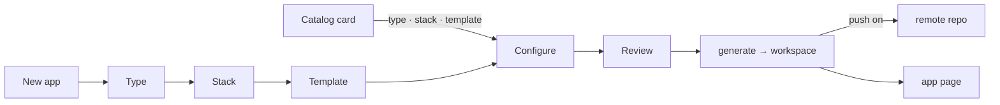

# The web app

`apps/web` — Next.js (App Router), better-auth, drizzle — on top of the Python API. Everything the CLI does, from a browser, for a team.

## Organization › Project › App

```mermaid
flowchart LR
    O[Organization] --> M[members]
    O --> T[Team]
    O --> H[code hosts]
    O --> P1[Project]
    O --> P2[Project]
    M -.-> T
    T -.->|owns| P1
    P1 --> A1[App · repo]
    P1 --> A2[App · repo]
    P2 --> A3[App · repo]
    H -.->|token| A1
```



| Level | What it is | Owns |
|---|---|---|
| **Organization** | the tenant (better-auth `organization` plugin); the sidebar switches between the ones you belong to | members, teams, code hosts, projects |
| **Team** | a group of organization members (`platform`, `payments`) | projects, at most one team per project |
| **Project** | the apps that ship together (`orders-platform`) | apps |
| **App** | one git repository, cloned by the API into `~/.action-platform/workspaces/<id>` (`/data` in Docker) | git-flow audit, commits, branches, tags, releases, configuration |

## First run: the setup wizard

`/setup` opens until an organization exists.

1. **Database** — SQLite (file), PostgreSQL or MySQL. Created when missing, schema migrated, URL saved to `config/app.json`. Skipped when `DATABASE_URL` is set.
2. **Admin** — the first account. Public sign-up stays closed afterwards.
3. **Organization** — name and slug.
4. **Source hosts** — connect GitHub / GitLab / Bitbucket, or skip.

Pending migrations run on boot, so upgrading the image is enough.

## Code hosts

Settings → **Connect a code host**.

**GitHub, in two clicks**: *Create GitHub App* opens GitHub with a pre-filled manifest (permissions: contents, workflows, administration, pull requests; callback already set); confirm the name and the app's credentials land in the platform. Then *Install the app on GitHub* on the account or organization whose repositories it should manage, and *Connect with GitHub*. Tokens from a GitHub App expire and are refreshed automatically.

Otherwise each provider needs an OAuth app registered once (GitHub: *I already have one*):

| Provider | Where | Callback |
|---|---|---|
| GitHub | Settings → Developer settings → OAuth Apps | `${PUBLIC_URL}/api/oauth/github/callback` |
| GitLab | Preferences → Applications (scopes `api write_repository read_user`) | `${PUBLIC_URL}/api/oauth/gitlab/callback` |
| Bitbucket | Workspace settings → OAuth consumers (account; repositories write/admin; pull requests write) | `${PUBLIC_URL}/api/oauth/bitbucket/callback` |

The *Set up OAuth app* dialog shows the callback URL to paste and stores the client id/secret in `config/app.json` (or read them from `GITHUB_CLIENT_ID` / `GITHUB_CLIENT_SECRET` etc.). Then **Connect with …** sends the member to the provider and comes back with a host named after the account (`GitHub · fernando`), owner defaulting to that login. GitLab and Bitbucket tokens expire and are refreshed before use.

*Add with a token* is the manual path: kind, base URL for self-hosted instances, username where the provider needs one, token, default owner. *Other* is any git server over HTTPS (push and tag only — no releases, no pull requests).

Tokens are AES-256-GCM encrypted with a key derived from `BETTER_AUTH_SECRET` and decrypted only to accompany a push / release call to the API.

## Templates

The catalog merges the official repository with the ones the organization added. **Template repositories** at the top of the page lists each source with its URL, ref and counts; owners and admins add or remove repositories there — any git repository works and becomes one template (a copy of its tree), or a whole catalog when it has an `index.toml`. Custom templates carry their source name on the card, in the wizard and in Configuration → Deploy target, and are generated from their own repository. Cloud cards open *Apply to app*.

## Creating an app



**Projects → project → New app**, or a template card under **Templates** (which opens the wizard at *Configure* with type, stack and template filled in).

1. **Type** — web, library, docs, plugin, empty
2. **Stack** — filtered by type
3. **Template** — the `Default` badge marks the stack's default
4. **Configure** — project name (directory and package name follow it), description, project, source host and repository owner; options: git init, CI provider, Docker overlay (when the template supports it), push to the remote
5. **Review** — summary plus the equivalent `action-platform init …` command

*Create project* generates the app into a workspace on the API, registers it, and — when *push* was on — creates the repository on the host and pushes `main`. Without push, the app page offers **Push to remote** later.

**Add an existing repository** on the project page takes a git URL; the API clones it (it must already contain a `platform.toml` — run `action-platform install` there first).

### Importing a repository without the platform

Project → **Add an existing repository** with any git URL. When the repository has no `platform.toml` the platform offers to install it: pick the type and CI, and the clone receives `platform.toml`, `.code_quality/`, the CI files and the git hooks (the language is detected). Nothing is pushed — the app opens on Configuration with the changes uncommitted, and **Commit changes** puts them on a `chore/<code>` branch with a pull request.

## The app page

- **Sync** (`git fetch` + fast-forward) or **Push to remote** while there is none
- git-flow audit of the current branch and its commits
- commits, remote branches with their git-flow kind, tags
- **Release**: level → *Preview* (dry run: next version and changelog) → *Release* dialog → tag, push, release on the host. Off `main`/`master` it is an `-rc.N` pre-release.
- **Activity**: git-flow (start a `<kind>/<code>` branch, check out a branch, propose and open a pull request) and the pull requests stored for the app (state, merged date, head → base).
- **Configuration**: pick a deploy target (applies the cloud overlay from the templates repository), add a service, edit `platform.toml`. Edits stay in the workspace until **Commit changes** (Conventional Commit, optional push, optional pull request). On `main`/`master`/`develop` the dialog requires a new `<kind>/<code>` branch: the changes are stashed, the branch starts from the right base, the commit lands there, and a pull request is opened when asked.
- **Sync** does `git fetch --prune --tags` + fast-forward in the workspace (skipped when the branch has no upstream), then imports releases and pull requests from the code host into the `release` and `pull_request` tables (upsert by tag / number). Adding an app, releasing and opening a pull request run the same import. **Last synced** is stored per app and shown in the header.

Deploying is done by the CI of the repository (see [templates](templates.md)), not by the web app.

Every confirmation is an in-app dialog; the UI is strictly monochrome.

## Settings

Organization members, code hosts (add, update token, remove), the API URL and the git-flow rules.

### Roles

| Role | Can |
|---|---|
| `owner` | everything; at least one per organization |
| `admin` | members, teams, code hosts, projects, every app action |
| `deployer` | releases, configuration, branches, pull requests, sync |
| `developer` | configuration, branches, pull requests, sync |
| `viewer` | read-only |

Permissions are `org.manage`, `project.manage`, `app.release`, `app.configure`, `app.flow`, `app.sync` (matrix in Settings → Roles and permissions, source in `apps/web/lib/permissions.ts`). Server actions check them; the UI hides or disables what the role cannot do.

### Code hosts per organization

Every organization connects its own accounts: **Connect with GitHub** in organization A can be a personal account, in organization B the company's GitHub organization — nothing is shared between them. There is one connection per GitHub user; **Install on another organization** installs the GitHub App on more accounts or organizations. Each one becomes selectable as the **Organization** that owns the repository when creating an app (the wizard lists every account the app is installed on with permission to create repositories, with a link to install it elsewhere). **Source hosts** shows the login, where the app is installed, and the *default owner* the wizard pre-selects. Apps remember which host they use.

GitLab and Bitbucket work the same way with one OAuth application registered once (Settings → *Set up OAuth app*): **Connect with GitLab** signs the organization in with your GitLab user, and the wizard offers your user plus every group you can create projects in (Bitbucket: every workspace) as the namespace that owns the new repository.

### Members and invitations

Owners and admins add people from Settings → **Members**: **Add member** creates the account (name, email, password) or attaches an existing one; **Invite** produces a link instead. No email is sent: the dialog produces a link (`/invite/<id>`, valid 7 days, bound to that address) to share. Opening it lets the person sign in or create an account and join with the invited role. 

### Teams

**Teams** in the sidebar. A team has members (organization members only) and projects; a project belongs to at most one team, assigned from the team page or from the project card's menu. Deleting a team leaves its projects without one.

## CLI and MCP against a hosted instance

```bash
action-platform login https://platform.example.com   # device flow: approve a code at /device
action-platform whoami
action-platform mcp --remote
```

Requests go to `/api/v1/*` on the web app with `Authorization: Bearer <token>`; the route checks the session and forwards to the Python API.
